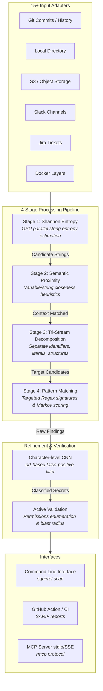

# 🐿️ Secret Squirrel

**Secret Squirrel** is a next-generation, GPU-accelerated, AI-powered credential scanner. Designed as a high-performance, drop-in replacement for Betterleaks and Gitleaks, it combines raw hardware-accelerated processing with deep-learning false-positive mitigation and extensive, multi-source coverage.

Secret Squirrel runs a **4-stage high-performance scanning pipeline** (Shannon Entropy → Semantic Proximity → Tri-Stream → Pattern Matching) utilizing GPU hardware (via `wgpu` with SIMD/Rayon CPU fallbacks) and character-level CNN classifiers (via ONNX runtime in GitHub Action/Docker profiles) to scan 15+ sources with >99% confidence and near-zero false positives.

---

## 🚀 Key Architectural Features

- **⚡ Hyper-Speed Detection Engine:** Reaches 1-3 GB/s throughput by shifting heavy pre-filtering computation (Shannon Entropy, Semantic Proximity, and Tri-Stream Decomposition) to the GPU using WGSL compute shaders via `wgpu`.
- **🧠 ML-Enhanced False-Positive Filter:** Incorporates a tiered character-level CNN (ONNX runtime) and 64-char Markov chain randomness scoring to filter out high-entropy garbage (random hashes, session tokens) and retain actual credentials.
- **🤖 AI-Agent Native (MCP):** Built-in Model Context Protocol (MCP) server exposing tools like `scan_diff`, `scan_file`, `scan_text`, and `validate_finding` for real-time AppSec integration with AI-assisted software engineering agents (Cursor, Claude Code, Copilot).
- **📂 Unified Multi-Source Adapters:** Adapts beyond Git repositories to scan Docker layers, Kubernetes secrets, Terraform state, AWS S3/Cloud Storage, Slack, Jira, GitHub Actions logs, and dotenv configurations.
- **🛡️ Secure Verification & Blast Radius Enrolling:** Opt-in, rate-limited validation engine verifying credentials against 30+ providers (AWS, GitHub, GCP, Stripe, etc.) to report their immediate permissions context ("blast radius") without exposing credentials.
- **🔄 Gitleaks & Betterleaks Compatibility:** Seamlessly reads `.gitleaks.toml` and `.betterleaks.toml` rules out of the box, ensuring friction-free migration.

---

## 🗺️ System Architecture

Secret Squirrel is structured around an optimized, multi-layered processing pipeline designed to eliminate the performance bottlenecks of regex engines:

---

## 📖 Planning & Specification Documents

All engineering designs, product requirements, and technical specifications are committed to the [docs/](docs/) directory:

- 📄 **[Product Requirements Document (PRD)](docs/prd.md):** Outlines product scope, user personas, deployment profiles, success metrics, and the 15 primary source adapters slated for v1.0.
- 📄 **[Technical Design Document (TDD)](docs/tdd.md):** Deep technical blueprint covering GPU memory layouts, WGSL kernel design, ONNX character-level CNN model configurations, Markov chain scoring algorithms, dual-sync/async trait architecture, and secure validation rate limiting.
- 📄 **[Master Implementation Plan](docs/implementation_plan.md):** Comprehensive 4-phase rollout plan containing detailed task breakdowns (40 granular tasks, ~150 steps) complete with individual dependencies, target files, and automated verification procedures.
- 📄 **[Research & Model Strategy Synthesis](docs/research_synthesis.md):** Details the character-level CNN design, parameter sizes (500K to 66M), and the 15-dataset credential training corpus (over 19 million lines) used for model optimization.
- 📄 **[Review & Architecture Synthesis](docs/review_synthesis.md):** Summary of consensus decisions, design trade-offs, and critical review gates validated by security, code quality, infrastructure, and architectural review agents.
- 📄 **[Betterleaks Performance Hypotheses](docs/betterleaks_hypotheses.md):** Initial technical research examining Betterleaks architecture, bottlenecks, and the structural enhancements implemented in Secret Squirrel.

---

## 🛠️ Project Status & Execution Plan

We are currently embarking on **Phase 1: Foundations & Core Architecture**. The engineering roadmap is organized as follows:

- [ ] **Phase 1: Foundations & Core Architecture:** Cargo setup, GPU device abstraction, CLI configuration interfaces, and core custom types (e.g., zeroized `RedactedString`).
- [ ] **Phase 2: The GPU Pipeline:** Shannon Entropy compute shaders, Semantic Proximity heuristics, and Tri-Stream WGSL kernels.
- [ ] **Phase 3: Host Execution & Logic:** Multi-threaded CPU fallback, Regex pattern matching, Markov chain scoring, 800+ backward-compatible rules, and core Git/Directory/S3 adapters.
- [ ] **Phase 4: ML, MCP & Integration:** ONNX character-level CNN classification, standard MCP stdio/SSE server, active secure validation APIs, and custom CLI endpoints (`squirrel protect`, `squirrel model pull`).

## ⚖️ License

Secret Squirrel is distributed under the terms of the **Apache License (Version 2.0)**. See the [LICENSE](LICENSE) file for details.
