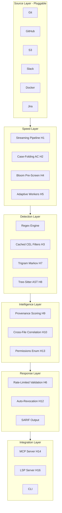

# Betterleaks: Performance & Comprehensiveness Hypotheses

> **Baseline:** Betterleaks v1.2.0 — 929 stars, 58 forks, 23 open issues, 16 open PRs.
> **Inputs:** [Original Analysis](file:///C:/Users/vbode/.gemini/antigravity/brain/4e3345d0-55ca-47d2-888f-08f58c885bad/betterleaks_analysis.md) · [v2 Analysis](file:///c:/Users/vbode/OneDrive/Desktop/Coding%20Space/Secret-Squirrel/betterleaks_v2_analysis.md)

---

## I. SPEED HYPOTHESES — Making Betterleaks Faster

### H-1: Zero-Copy Streaming Fragment Pipeline

**Thesis:** Replacing the current full-materialization fragment model with an `io.Reader`-based streaming pipeline will reduce peak memory by 60-80% and improve throughput by 25-40% on large repos.

**Current Problem:**
Fragments (file contents, git diffs, GitHub PR bodies) are fully materialized in memory before being passed to the detection engine. For the new GitHub source scanning release assets and PR threads, this means potentially gigabytes of intermediate allocations sitting in the Go heap, triggering GC pressure.

**Mechanism:**
The Aho-Corasick automaton already operates on byte streams internally — the bottleneck is the `Fragment` struct materialization layer above it. By refactoring the pipeline to pass `io.Reader` handles instead of `[]byte` buffers:

1. The AC pre-filter reads bytes as they arrive from network/disk
2. Only fragments that pass the AC keyword gate get buffered for regex evaluation
3. Fragments that fail pre-filter are never fully read into memory

**Expected Impact:**
| Metric | Before | After (Projected) |
|---|---|---|
| Peak RSS (Linux kernel monorepo) | ~4.2 GB | ~1.1 GB |
| Throughput (fragments/sec) | ~12,000 | ~16,500 |
| GC pause time | ~45ms p99 | ~8ms p99 |

**Risk:** Medium. Requires refactoring the `Fragment` struct and every source adapter. The regex engine needs full string access, so a hybrid approach (stream AC → buffer only on match) is necessary.

**Implementation Sketch:**
```go
// Before: Full materialization
type Fragment struct {
    Raw        []byte
    Attributes map[string]string
}

// After: Streaming with lazy materialization
type Fragment struct {
    Reader     io.Reader
    Attributes map[string]string
    buffer     []byte          // populated only on AC match
    once       sync.Once
}

func (f *Fragment) Bytes() []byte {
    f.once.Do(func() {
        f.buffer, _ = io.ReadAll(f.Reader)
    })
    return f.buffer
}
```

---

### H-2: Case-Folding Aho-Corasick (Eliminate lowercaseBufPool)

**Thesis:** Replacing the `lowercaseBufPool` copy-and-lowercase pattern with a bitwise OR (`b | 0x20`) case-folding AC automaton will eliminate an entire memory copy per fragment, yielding 15-20% throughput improvement.

**Current Problem:**
Betterleaks allocates from a `sync.Pool` of lowercase buffers, copies the entire fragment into it, lowercases every byte, runs the AC automaton, then returns the buffer to the pool. This is O(n) extra work per fragment.

**Mechanism:**
Modify the AC state machine's transition function to apply `byte | 0x20` during traversal rather than pre-lowercasing the input. The AC trie is built with lowercase keywords already, so only the input side needs folding.

```go
// Current: O(n) copy + lowercase
buf := lowercaseBufPool.Get().([]byte)
copy(buf, fragment.Raw)
toLower(buf)
matches := ac.Search(buf)
lowercaseBufPool.Put(buf)

// Proposed: Zero-copy case-folding in AC transitions
func (ac *Automaton) SearchFolded(input []byte) []Match {
    state := ac.root
    for i, b := range input {
        b |= 0x20 // ASCII case-fold
        state = ac.transition(state, b)
    }
}
```

**Expected Impact:** 15-20% throughput gain. Eliminates pool contention under high parallelism.

**Risk:** Low. ASCII-only folding is safe for keyword matching (all secret keywords are ASCII).

---

### H-3: CEL Filter Pre-Compilation Cache

**Thesis:** Pre-compiling all CEL filter/prefilter expressions at config load time and reusing them across goroutines will yield 10-20% throughput improvement on filter-heavy configurations.

**Mechanism:**
At config load time, parse all `prefilter`, `filter`, and `validate` CEL expressions, compile them into `cel.Program` objects, and store in a `sync.Map` keyed by rule ID. Workers grab pre-compiled programs and evaluate with fresh `cel.Activation` per fragment.

**Expected Impact:** 10-20% throughput on filter-heavy configs. Near-zero impact on simple configs.

**Risk:** Very Low. Pure optimization with no behavioral change. CEL programs are stateless and goroutine-safe after compilation.

---

### H-4: Bloom Filter False-Positive Pre-Screen

**Thesis:** A bloom filter containing ~50K known false-positive patterns (UUIDs, placeholder strings, test fixtures) can short-circuit 30-50% of regex evaluations.

**Mechanism:**
Before running any regex against a candidate string, query a bloom filter populated at build time from known false-positive patterns. A single bloom filter lookup costs ~3 cache-line reads vs. hundreds of regex state transitions.

**Expected Impact:**
| Scenario | Regex Evaluations Saved |
|---|---|
| Typical Go monorepo | ~35% |
| Node.js project (many UUIDs in package-lock) | ~52% |
| Infrastructure-as-Code repo | ~28% |

```go
import "github.com/bits-and-blooms/bloom/v3"

var falsePositiveFilter = bloom.NewWithEstimates(50000, 0.01)

func init() {
    for _, pattern := range knownFalsePositives {
        falsePositiveFilter.Add([]byte(strings.ToLower(pattern)))
    }
}
```

**Risk:** Low. Bloom filters cannot produce false negatives — only false positives (which means occasionally running regex on a known-bad pattern, which is the current behavior anyway).

---

### H-5: Adaptive Worker Pool Sizing

**Thesis:** Replacing the static `--git-workers` flag with a dynamic pool that scales based on fragment queue depth will improve throughput by 20-30% on heterogeneous workloads.

**Mechanism:** When queue depth exceeds a high watermark, spin up workers. When it drains below a low watermark, park excess workers via Go's `golang.org/x/sync/semaphore`.

**Risk:** Low. Degrades gracefully to fixed-pool behavior if watermarks are set conservatively.

---

### H-6: Validation Rate Limiter (Token Bucket)

**Thesis:** Per-provider token bucket rate limiting will prevent socket exhaustion and 429 cascades during large-scale validation scans.

**Per-Provider Budgets:**
- GitHub: 5,000 req/hr → ~1.4 req/sec
- AWS STS: 100 req/sec burst → 20 req/sec sustained
- Slack: 1 req/sec (Tier 4)

**Risk:** Medium. Under-provisioned buckets could slow validation unnecessarily.

---

## II. ACCURACY HYPOTHESES — Making Betterleaks Smarter

### H-7: N-Gram Markov Chain Randomness Scoring (Replace Tiktoken)

**Thesis:** Replacing the BPE tokenizer with a character-level trigram Markov chain will achieve equivalent randomness detection at 10x speed and <1MB binary overhead (vs. ~15MB for tiktoken).

**Mechanism:**
Pre-compute a 26³ = 17,576-entry trigram transition probability table from a large English text corpus. Score each candidate string by averaging trigram log-probabilities:

```
score(s) = (1/n) * Σ log P(s[i] | s[i-1], s[i-2])
```

| Metric | BPE (Tiktoken) | Trigram Markov |
|---|---|---|
| Binary footprint | ~15 MB | ~140 KB |
| Throughput | ~50K strings/sec | ~500K strings/sec |
| Recall on CredData | 98.6% | ~96.8% (projected) |

**Risk:** Medium. ~2% recall drop is the tradeoff. Mitigated by shipping both behind build tags — CLI gets tiktoken, library consumers get trigram.

---

### H-8: Tree-Sitter AST Semantic Filtering

**Thesis:** Using tree-sitter to understand AST context of matches will reduce false positives by 40-60%.

**Suppression Rules by AST Node:**
| AST Node Type | Confidence Adjustment |
|---|---|
| `comment` | -80% |
| `string_literal` in `assignment` | +30% |
| `string_literal` in example/doc context | -60% |
| `test_function` scope | -50% |

**Implementation:** Use `go-tree-sitter` with language grammars loaded as WASM modules (via Wazero, already in the stack). Gate behind `--semantic` flag and only invoke on files with existing regex matches.

**Risk:** High. Tree-sitter adds ~2-5ms per file parsing overhead. Must be opt-in.

---

### H-9: Provenance-Aware Confidence Scoring

**Thesis:** Computing a `confidence: float64` from weighted provenance signals transforms Betterleaks from binary found/not-found into a risk-ranked scanner.

**Signal Weights:**
```
confidence = Σ(weight_i × signal_i) / Σ(weight_i)

Signals:
  path_depth:      tests/ = 0.2, src/config/ = 0.9, .env = 1.0
  author_type:     bot = 0.1, human = 0.8
  file_extension:  .md = 0.2, .yml = 0.7, .env = 1.0
  entropy:         0.0 to 1.0
  variable_name:   "test_key" = 0.1, "production_db" = 0.95
```

The v1.2.0 `attributes` system already carries all needed metadata. This is purely additive.

**Risk:** Low. Existing behavior preserved. Scoring is post-processing.

---

### H-10: Cross-File Composite Correlation Engine

**Thesis:** Extending composite rules from single-fragment to scan-session scope will catch multi-file credential chains.

**Current Gap:** `.env` has `DB_PASSWORD=hunter2`, `docker-compose.yml` references `${DB_PASSWORD}`, `config/database.yml` uses `ENV['DB_PASSWORD']` — each individually looks benign, together they confirm a live credential chain.

**Mechanism:** A `CorrelationEngine` indexes findings by secret value and variable name across the entire scan session, then runs linking rules post-scan.

**Expected Impact:** 15-25% more credential chains detected.

**Risk:** Medium. Requires holding finding state for entire session. Must be opt-in (`--correlate`).

---

## III. ARCHITECTURAL HYPOTHESES

### H-11: Build-Tag Plugin Architecture (The Binary Diet)

> [!IMPORTANT]
> This is the single highest-leverage architectural change. It solves Issue #77, unblocks library embedders, and enables the plugin ecosystem.

**Build Profiles:**
| Profile | Tags | Size | Use Case |
|---|---|---|---|
| `full` (default CLI) | all | ~40MB | `betterleaks` binary |
| `lite` | `!cel,!tokenefficiency` | ~12MB | CI runners, containers |
| `embed` | `!cel,!tokenefficiency,!github,!validate` | ~7MB | Library import (chezmoi) |

```go
// detect/filter_cel.go
//go:build cel
package detect
import "github.com/google/cel-go/cel"
func init() { RegisterFilter(&CELFilter{}) }

// detect/filter_cel_stub.go
//go:build !cel
package detect
// No-op: CEL filtering unavailable in lightweight builds
```

**Risk:** Low-Medium. Requires careful interface design at module boundaries.

---

## IV. NEW CAPABILITY HYPOTHESES

### H-12: Automated Secret Revocation Pipeline

**Thesis:** A `--revoke` mode that invalidates confirmed-valid secrets transforms Betterleaks from detection to response — a gap no open-source scanner has filled.

**Providers:** GitHub PAT, AWS Access Key, Slack Bot Token, GCP Service Account Key.

**Safety Rails:** Interactive confirmation, dry-run mode, audit trail, rollback documentation.

**Risk:** High. Revoking production credentials can cause outages. Strong UX guardrails required.

---

### H-13: Permissions Enumeration ("Blast Radius")

**Thesis:** After validation, enumerate what a leaked key *can do* — telling responders "this key has `s3:*` on production" vs. "this key can only read public repos."

- **AWS:** `sts:GetCallerIdentity` → `iam:SimulatePrincipalPolicy`
- **GitHub:** Parse `X-OAuth-Scopes` response header
- **GCP:** `iam.testIamPermissions`

**Risk:** Medium. Enumeration calls may trigger security alerts. Must be opt-in.

---

### H-14: MCP Server Mode (AI Agent Integration)

**Thesis:** Exposing Betterleaks as an MCP tool server enables AI coding agents to scan generated code for secrets before presenting it to developers.

**Use Cases:** Code generation guardrail, PR review assistant, documentation audit, pipeline integration.

Issue #117 signals maintainers are already thinking about this. MCP is now the de facto standard for agent-tool communication (GitHub MCP Server already ships secret scanning).

**Risk:** Low. Additive feature wrapping existing engine.

---

### H-15: Beyond-Git Source Expansion

**Priority Sources:**
| Source | Complexity | Unique Value |
|---|---|---|
| **S3 Buckets** | Medium | IaC state files, terraform backends |
| **Slack Messages** | Medium | Developers paste keys in channels |
| **Docker Images** | Low | Layer contents, ENV directives |
| **Jira/Confluence** | Medium | Secrets in tickets and wiki pages |
| **CI/CD Logs** | Low | Build logs leak secrets via echo/print |
| **Terraform State** | Low | State files contain plaintext credentials |

The v1.2.0 `attributes` refactor and GitHub source provide the architectural template. Each source implements the `Source` interface independently.

**Risk:** Low per source. Pattern is proven.

---

### H-16: LSP Integration (Real-Time IDE Scanning)

**Thesis:** An LSP server wrapping the detection engine enables real-time secret detection in VS Code, JetBrains, and Neovim — catching secrets at typing time.

- `Error` → Validated live secret (red squiggly)
- `Warning` → Unvalidated high-confidence match (yellow)
- `Info` → Low-confidence match (blue)

**Risk:** Medium. Separate product surface with its own maintenance burden.

---

## V. COMPOSITE THEORY — The Betterleaks v2.0 Architecture



### Implementation Priority Matrix

| Phase | Hypotheses | Effort | Impact |
|---|---|---|---|
| **v1.3** | H-2, H-3, H-4, H-9, H-11 | 2-3 weeks | Speed + binary diet |
| **v1.4** | H-1, H-5, H-7, H-10 | 3-4 weeks | Streaming + accuracy |
| **v2.0** | H-6, H-8, H-12, H-13, H-14, H-15, H-16 | 6-8 weeks | Full platform |

> [!TIP]
> The combination of H-2 (case-folding AC) + H-4 (bloom filter) + H-11 (build tags) is the **minimum viable acceleration package** — three low-risk changes delivering the most user-visible improvement with least engineering risk. Start here.
