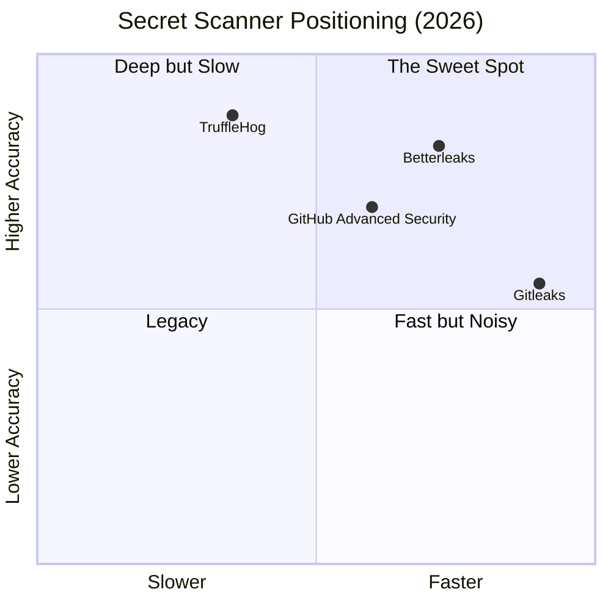
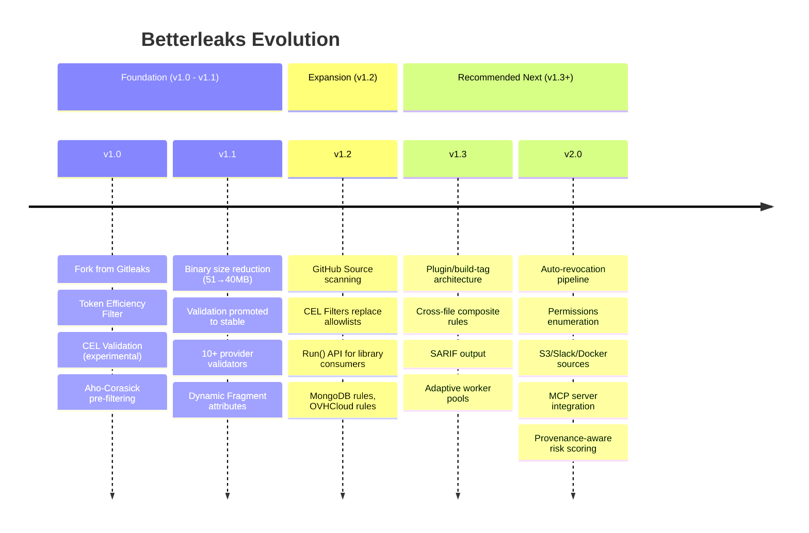

# Betterleaks v1.2.0: Updated Analysis & Market-Driven Feature Roadmap

> **Context:** This is a follow-up to our [original analysis](file:///C:/Users/vbode/.gemini/antigravity/brain/4e3345d0-55ca-47d2-888f-08f58c885bad/betterleaks_analysis.md). Since that review (~5 weeks ago), Betterleaks shipped **v1.2.0** and the project has nearly doubled its community engagement (743 → 929 stars, 34 → 58 forks, 13 → 23 open issues, 1 → 16 PRs).

---

## 📊 What Changed Since Our Last Analysis (v1.1.2 → v1.2.0)

### 1. Native GitHub Source Scanning
Betterleaks can now scan **entire GitHub organizations, users, PRs, issues, discussions, releases, action artifacts, and gists** natively:
```bash
betterleaks github https://github.com/betterleaks --include prs,issues,discussions,releases,actions
```
This is a major competitive leap. TruffleHog has historically been the only tool scanning beyond git repos into platform metadata. Betterleaks is now directly encroaching on TruffleHog's "depth" territory while maintaining its speed advantage.

### 2. CEL-Based Filtering (Replacing Legacy Allowlists)
The biggest architectural shift in v1.2.0. Betterleaks replaced static allowlists, entropy checks, and token-efficiency checks with **dynamic CEL (Common Expression Language) filter expressions**:
- **`prefilter`** — Runs before any regex, accesses only file/commit metadata. Skip entire binary files or bot commits at zero cost.
- **`filter`** — Runs after regex match, accesses the finding itself. Discard by entropy, token efficiency, path glob, author, or any combination.

This is exactly the kind of programmable filtering pipeline we recommended. CEL filters are composable, source-agnostic, and eliminate the need for rigid allowlist TOML arrays.

### 3. Dynamic Source Attributes (`map[string]string`)
The `Fragment` struct was refactored from hardcoded fields (`CommitInfo`, `WindowsFilePath`) to a generic `map[string]string` attributes system. This paves the way for new sources (Slack, S3, Jira) without touching the core engine.

### 4. Growing Community & Open Issues
| Metric | v1.1.2 (Apr 9) | v1.2.0 (May 14) | Δ |
|---|---|---|---|
| ⭐ Stars | 743 | 929 | +25% |
| 🍴 Forks | 34 | 58 | +71% |
| 🐛 Open Issues | 13 | 23 | +77% |
| 🔀 Open PRs | 1 | 16 | +1500% |

> [!IMPORTANT]
> The explosion in PRs (1 → 16) signals that the community is actively contributing. This is the critical inflection point where architectural decisions about plugin boundaries, API stability, and contributor onboarding will define the project's trajectory.

---

## 🔬 Market Research: What Security Engineers Actually Want

Based on cross-referencing industry research, competitor analysis, and the open issue tracker:

### The 2026 Secret Scanner Competitive Landscape



### Top Requested Capabilities (Market-Wide)

| Priority | Feature | Who Wants It | Betterleaks Status |
|---|---|---|---|
| 🔴 Critical | **Credential Verification** (is this key live?) | Every security team | ✅ Shipped (CEL validators) |
| 🔴 Critical | **Sub-5s Pre-commit Hooks** | Every developer | ✅ Inherent (Aho-Corasick + parallelism) |
| 🟠 High | **Beyond-Git Scanning** (S3, Slack, Jira, Docker) | Enterprise SOC teams | 🟡 Started (GitHub source in v1.2.0) |
| 🟠 High | **Automated Remediation** (revoke/rotate on find) | Incident Response teams | ❌ Not started |
| 🟡 Medium | **Permissions Mapping** (what can this key do?) | Cloud Security Architects | ❌ Not started |
| 🟡 Medium | **SARIF/SPDX Output** for compliance frameworks | GRC/Audit teams | 🟡 Partial (JSON/CSV) |
| 🟢 Low | **LLM-Assisted Classification** | R&D / Innovation teams | ❌ Roadmap only |

### Key Open Issues Reflecting Market Demand

| Issue | Signal |
|---|---|
| [#124](https://github.com/betterleaks/betterleaks/issues/124) — Burp Suite Extensions | Pentesters want Betterleaks integrated into offensive security workflows |
| [#114](https://github.com/betterleaks/betterleaks/issues/114) — Validate against GHES | Enterprise GitHub Server customers need on-prem validation |
| [#107](https://github.com/betterleaks/betterleaks/issues/107) — GitHub App installation tokens | Token format drift; rules need to stay current |
| [#105](https://github.com/betterleaks/betterleaks/issues/105) — Multi-registry Docker images | DevOps teams want GHCR, ECR, and Docker Hub |
| [#86](https://github.com/betterleaks/betterleaks/issues/86) — DetectSource state reset | Library consumers need stateless re-entrant scanning |
| [#77](https://github.com/betterleaks/betterleaks/issues/77) — 20MB binary bloat | Still open. Library embedders are blocked. |

---

## 🚀 Recommendations: Making Betterleaks Even Faster & Better

### Speed Optimizations

#### 1. CEL Filter Compilation Cache
The new CEL filter system is powerful but introduces a hidden cost: CEL programs are parsed and compiled per-evaluation. For repos with millions of fragments, this adds up.
- **Recommendation:** Pre-compile all CEL filter/prefilter expressions into a `cel.Program` pool at config load time. Cache the compiled programs and reuse them across all worker goroutines. This is a zero-cost change for accuracy but could yield 10-20% throughput improvement on filter-heavy configs.

#### 2. Streaming Fragment Pipeline (Zero-Copy)
Currently, fragments are fully materialized in memory before being passed to the detection engine. For the new GitHub source (which downloads release assets, PR bodies, etc.), this means potentially gigabytes of intermediate allocations.
- **Recommendation:** Implement an `io.Reader`-based streaming pipeline where fragments are scanned as they arrive from the network. The Aho-Corasick automaton already operates on byte streams — the bottleneck is the fragment materialization layer above it.

#### 3. Bloom Filter Pre-Screen for Known-Good Patterns
Before running any regex, check the candidate string against a Bloom filter of known false-positive patterns (UUIDs, placeholder strings like `xxxx-xxxx`, common test fixtures). A single Bloom filter lookup costs ~3 cache-line reads vs. potentially hundreds of regex state transitions.

#### 4. Adaptive Worker Pool Sizing
The `--git-workers` flag is static. For mixed workloads (small repos + large monorepos), a fixed pool size is suboptimal.
- **Recommendation:** Implement adaptive pool sizing based on fragment queue depth. When the queue is deep, spin up workers. When it drains, park them. Go's `semaphore` package makes this trivial.

### Accuracy Improvements

#### 5. Provenance-Aware Scoring
The new `attributes` system enables something powerful: **provenance-aware confidence scoring**. A secret found in `tests/fixtures/` by a `dependabot[bot]` author should have a fundamentally different confidence score than one found in `src/config/production.yml` by a human developer.
- **Recommendation:** Extend the finding struct with a `confidence: float64` field that is computed from a weighted combination of: path depth, author type, file extension, entropy, token efficiency, and proximity to known config patterns. This transforms Betterleaks from a binary "found/not-found" scanner into a **risk-ranked** scanner.

#### 6. Cross-File Composite Validation
The existing composite rules (`require` with `withinLines`) are powerful but limited to a single fragment. Security engineers routinely encounter multi-file credential patterns:
- `.env` has `DB_PASSWORD=...`
- `docker-compose.yml` has `POSTGRES_PASSWORD=${DB_PASSWORD}`
- `config/database.yml` has `password: <%= ENV['DB_PASSWORD'] %>`

Betterleaks should support **cross-fragment composite rules** that correlate findings across an entire scan session, not just within one file.

### Architectural: The Plugin Question

#### 7. Yes — Selectable Plugins Would Transform Betterleaks

> [!IMPORTANT]
> This is the single highest-impact architectural change Betterleaks can make.

The v1.2.0 release actually **makes the case stronger** for plugins, not weaker. Here's why:

**The Problem is Getting Worse:**
- v1.2.0 added the GitHub source, which pulls in `github.com/google/go-github` and its HTTP client stack
- The CEL filter system added more CEL runtime overhead
- Issue #77 (binary bloat) is still open with no resolution
- 16 open PRs suggest new sources (Slack? S3?) are coming, each adding more dependencies

**The Plugin Architecture Should Follow the Source/Filter/Validator Triad:**

```mermaid
graph LR
    subgraph Core ["Core Engine (~5MB)"]
        AC[Aho-Corasick Filter]
        RE[Go stdlib Regex]
        DET[Detection Loop]
        RPT[Report Generator]
    end

    subgraph Source Plugins ["Source Plugins (loadable)"]
        GIT[Git Source]
        GH[GitHub Source]
        S3[S3 Source]
        SLACK[Slack Source]
        DOCKER[Docker Source]
    end

    subgraph Filter Plugins ["Filter Plugins (loadable)"]
        CEL[CEL Filter Runtime]
        TEF[Token Efficiency Filter]
        BLOOM[Bloom Filter]
    end

    subgraph Validator Plugins ["Validator Plugins (loadable)"]
        CELV[CEL Validator + HTTP]
        AWS[AWS SDK Validator]
        VAULT[HashiCorp Vault Hook]
    end

    Source Plugins --> Core
    Core --> Filter Plugins
    Core --> Validator Plugins
```

**Implementation Strategy using Go Build Tags + Interfaces:**
Rather than dynamic plugin loading (which has poor Go ecosystem support), use **build tags** to conditionally compile features:

```go
// detect/filter.go — the interface
type Filter interface {
    Name() string
    Evaluate(finding Finding, attrs map[string]string) bool
}

// detect/filter_cel.go — behind build tag
//go:build cel
func init() {
    RegisterFilter(&CELFilter{})
}

// detect/filter_tokenefficiency.go — behind build tag
//go:build tokenefficiency
func init() {
    RegisterFilter(&TokenEfficiencyFilter{})
}
```

This means:
- `go build` → full-featured CLI binary (~40MB)
- `go build -tags '!cel,!tokenefficiency'` → embeddable library (<10MB)
- Library consumers like `chezmoi` can import the core package and get Gitleaks-equivalent size
- Issue #77 is solved without removing any features from the CLI

### New Feature Recommendations (Market-Driven)

#### 8. Automated Secret Revocation Pipeline
When `--validation` confirms a secret is `valid`, Betterleaks should optionally trigger revocation:
- GitHub PATs → call the GitHub API to revoke
- AWS keys → call `iam:DeleteAccessKey`
- Slack tokens → call `auth.revoke`

This transforms Betterleaks from a **detection tool** into a **response tool** — the gap TruffleHog has but hasn't filled.

#### 9. Permissions Enumeration
After validating a secret is live, enumerate what it can do:
- AWS: Call `sts:GetCallerIdentity` + `iam:SimulatePrincipalPolicy`
- GitHub: Check token scopes from response headers
- GCP: Call `iam.testIamPermissions`

This tells the incident responder "this leaked key has `s3:*` on production" vs. "this key can only read public repos." Blast radius assessment built into the scanner.

#### 10. SARIF Output for GitHub Advanced Security Integration
Security teams running Betterleaks in CI want findings to appear as **GitHub Security Alerts** alongside CodeQL findings. SARIF (Static Analysis Results Interchange Format) output would enable this natively.

#### 11. MCP Server / Agent Integration
Issue #117 ("Write a more generic agents.md") signals that `zricethezav` is already thinking about this. Betterleaks should expose itself as an **MCP tool** so AI coding agents can invoke secret scanning as part of their workflows. Imagine an agent that automatically scans every code generation output for leaked secrets before presenting it to the developer.

---

## 📈 Summary: Betterleaks Trajectory



The project is on a strong trajectory. The v1.2.0 release validates our earlier recommendations (CEL everywhere, dynamic attributes for source extensibility) and opens the door for the plugin architecture that would solve both the binary bloat problem and the library embeddability problem in one shot.
