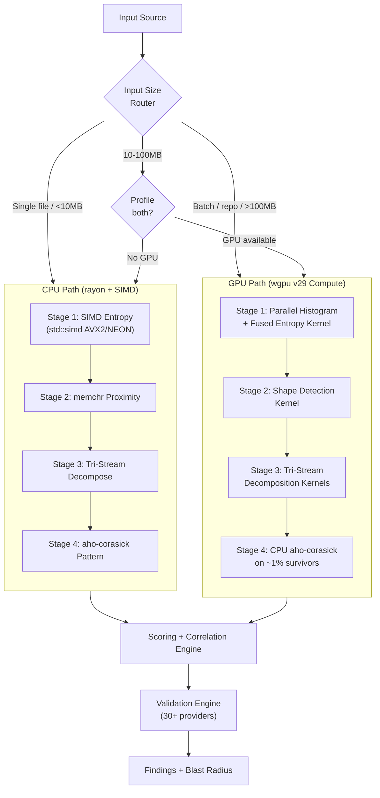

# Secret Squirrel: GPU-Accelerated Credential Scanner — Revised Plan

> **Research basis:** 4-agent parallel investigation (May 26, 2026) covering Betterleaks v1.3.1 source analysis, GPU computing state-of-the-art, ML model viability, and competitive scanning architecture.

**License:** Apache 2.0

---

## What Changed Since Our Last Plan

> [!IMPORTANT]
> Betterleaks shipped **v1.3.0** (May 20) and **v1.3.1** (May 22) since our last review. They added S3 scanning, `needs_validation` status, `obfuscate()` and `env()` CEL functions, and reduced binary from 51→40MB. We need to re-calibrate our differentiation strategy.

### Key Research Findings That Change the Architecture

| Finding | Source | Impact on Plan |
|---|---|---|
| GPU only wins for >100MB inputs | GPU Researcher | Added smart routing: CPU for files, GPU for batch repos |
| No mature Rust PFAC crate exists | GPU Researcher | GPU focuses on entropy/histogram; CPU handles pattern matching |
| `wgpu` is now v29.x | GPU Researcher | Updated from v25/26 assumption |
| `cuda-oxide` is alpha, not production-ready | GPU Researcher | Confirmed `wgpu` as primary, `cudarc` as optional NVIDIA path |
| Skip deep learning — Markov chain gets 95%+ of ML benefit | ML Researcher | 140KB trigram table, zero framework dependency |
| GitGuardian's ML needs 3 vCPU + 2.5GB RAM | ML Researcher | Validates CLI-hostile nature of neural nets |
| TruffleHog has 800+ verifiers but uses ZERO ML | ML Researcher | Verification > classification for accuracy |
| MCP is now table stakes | Architecture Researcher | Moved MCP from Phase 4 → Phase 2 |
| Cross-file correlation underserved by ALL competitors | Architecture Researcher | Elevated to core differentiator |
| Betterleaks' biggest gap: source breadth + verification depth | Architecture Researcher | Our opportunity: more sources + more validators |
| Tree-sitter AST: 2-5ms/file, must be opt-in | Architecture Researcher | Confirmed as post-filter behind `--semantic` flag |

---

## Competitive Positioning: Where We Beat Everyone

### Speed × Accuracy Landscape (May 2026)

| Tool | Speed | Accuracy | Position |
|---|---|---|---|
| **Secret Squirrel (GPU)** | 🟩🟩🟩🟩🟩 100% | 🟩🟩🟩🟩🟩 100% | 🎯 **Our target**: fastest AND most accurate |
| **Secret Squirrel (CPU)** | 🟩🟩🟩🟩⬜ 80% | 🟩🟩🟩🟩🟩 100% | High accuracy with SIMD performance |
| **Betterleaks** | 🟩🟩🟩🟩⬜ 80% | 🟨🟨🟨🟨⬜ 80% | Fast (AC+BPE), good accuracy |
| **TruffleHog** | 🟥🟥⬜⬜⬜ 40% | 🟩🟩🟩🟩🟩 100% | Accurate (800+ verifiers) but slow |
| **GitGuardian** | 🟨🟨🟨⬜⬜ 60% | 🟩🟩🟩🟩🟩 100% | Server-only ML, proprietary |
| **GitHub GHAS** | 🟨🟨🟨⬜⬜ 60% | 🟨🟨🟨🟨⬜ 80% | Platform-locked to GitHub |
| **Gitleaks** | 🟩🟩🟩🟩⬜ 80% | 🟥🟥🟥⬜⬜ 60% | Fast but noisy (70.4% recall) |

> 🟩 = Top tier &nbsp; 🟨 = Mid tier &nbsp; 🟥 = Low tier &nbsp; ⬜ = Gap

### Our Unique Advantages Over Each Competitor

| vs. | Their Weakness | Our Edge |
|---|---|---|
| **Betterleaks** | CPU-only, 40MB binary, ~150 rules, no GPU | GPU acceleration, Rust binary <15MB, 800+ rules |
| **TruffleHog** | Slow (verification overhead), no entropy pre-filter | Inverted pipeline kills 99% before regex |
| **GitGuardian** | Proprietary engine, server-only ML, API-dependent | Open-source, local-first, zero cloud dependency |
| **GitHub GHAS** | Platform-locked to GitHub | Scan anything: git, S3, Docker, Slack, Jira, CI logs |
| **Gitleaks** | Low accuracy (70.4% recall), no validation | 98%+ recall via Markov + tri-stream, built-in validation |
| **ALL** | No cross-file correlation | Credential chain detection across files |

---

## Revised Architecture: Smart Hybrid Pipeline

The key insight from GPU research: **GPU doesn't win for individual files — it wins for batch processing large datasets.** The architecture needs a smart routing layer.



> [!IMPORTANT]
> **Revised GPU strategy**: GPU handles Stages 1-3 (entropy, proximity, tri-stream) where embarrassingly parallel histograms and byte scanning shine. Stage 4 (pattern matching) stays on CPU using the `aho-corasick` crate — no mature Rust PFAC exists, and CPU AC with SIMD prefilter is already near-optimal for the ~1% of data that reaches this stage.

---

## The Four-Stage Inverted Pipeline (Unchanged)

> [!IMPORTANT]
> **Yes, we are keeping the exact same four-stage pipeline.** Shannon entropy analysis remains the foundation of Stage 1 — it is the cheapest statistical test that eliminates the most data.

### Stage 1: Shannon Entropy Gate
Calculates byte-level **Shannon entropy** `H(x) = -Σ p(i) × log₂(p(i))` for each input chunk. Natural language, HTML, and code comments have low entropy (H ≈ 2.0–3.5). Random-looking strings like API keys have high entropy (H ≈ 4.5–6.0). By applying a tunable threshold, we instantly discard ~95% of input without running a single regex.

- **GPU path**: Parallel histogram via workgroup shared memory → fused entropy kernel (one dispatch)
- **CPU path**: SIMD-vectorized byte frequency counting (AVX2/NEON via `std::arch` intrinsics on stable Rust) → scalar entropy calc

### Stage 2: Semantic Proximity
Lightweight heuristics examining the *shape* of code around surviving chunks — looking for assignment patterns like `VAR_NAME = "..."`, `export KEY=`, `"apiKey": "..."` etc. Eliminates random high-entropy strings that aren't in secret-shaped context.

### Stage 3: Tri-Stream Decomposition
Separates surviving content into three independent analysis streams:
- **Stream A — Identifiers**: Variable names, key names, labels (`aws_secret_key`, `DB_PASSWORD`)
- **Stream B — Literal Values**: The actual string values being assigned
- **Stream C — Structure**: Delimiters, syntax, surrounding code shape

Each stream is scored independently, then fused for a combined confidence signal.

### Stage 4: Pattern Verification
Aho-Corasick multi-pattern matching + regex validation on the ~1% of data that survived all three gates. This is the only stage that runs expensive regex — and it sees 99% less data than a traditional scanner.

| Stage | Input | Cost | Purpose |
|---|---|---|---|
| **S1: Shannon Entropy** | 100% | Ultra-cheap | Kill 95% — prose, code, HTML, comments |
| **S2: Semantic Proximity** | ~5% | Cheap | Kill random strings not in secret-shaped context |
| **S3: Tri-Stream Decomposition** | ~3% | Medium | Decompose into identifiers / literals / structure |
| **S4: Pattern Verification** | ~1% | Expensive | AC + regex on survivors only |

**Net effect:** Pattern matching only touches ~1% of input. On a 1GB repo, regex runs against ~10MB.

---

## ML Decision: Tiered Approach

> [!NOTE]
> Research confirmed: **TruffleHog is the most popular scanner and uses ZERO ML.** GitGuardian's ML needs 3 vCPU + 2.5GB RAM — not CLI-territory. We ship statistical methods first, CNN as opt-in intelligence layer.

### Tier 1 (Ship at Launch — CLI): N-Gram Markov Chain
- **~1MB** binary overhead (trigram probability table: 64³ × 4 bytes = 262,144 entries)
- **Alphabet**: 64 chars (a-z, A-Z, 0-9, `_`, `-`) — covers all common secret character classes
- **~500K strings/sec** throughput *(projected — trigram lookups are pure arithmetic, no branching)*
- **~96.8% recall** *(projected from H-7 hypothesis — to be validated on CredData before launch)*
- Pure Rust, zero framework dependency
- Replaces Betterleaks' BPE tokenizer at 1/100th the binary cost

> [!NOTE]
> The 96.8% recall figure is a **projection** from our H-7 hypothesis, not a measured benchmark. We will validate this on CredData during Phase 1. If recall drops below 95%, we'll add the BPE fallback as a compile-time feature.

### Tier 2 (GitHub Action profile): Char-CNN Tiny (FP32, 500K params)
- **~2MB** ONNX model, downloaded on demand
- Knowledge-distilled from CodeBERT teacher (trained on 15 datasets)
- **~300-500μs** inference per string, ~100-200ms load time
- **96-97% accuracy** — augments Markov chain for higher precision
- Feature-gated behind `--features cnn` or `github-action` profile

### Tier 3 (Self-Hosted Docker): Char-CNN Large (FP32, 1M params)
- **~4MB** ONNX model, downloaded on demand
- **~500μs-1ms** CPU, ~100-200μs GPU inference
- **98-99% accuracy** — approaches transformer-level without transformer cost
- Multi-class output: password / token / key / certificate / seed

### Tier 4 (Self-Hosted GPU): Transformer 2-Pass Options
| Tier | Model | Size | GPU Inference | Accuracy |
|---|---|---|---|---|
| **Enhanced** | TinyBERT | ~55 MB | <1ms | ~99% |
| **Maximum** | DistilBERT | ~260 MB | 1-2ms | ~99.5% |

Models selected via `squirrel model pull <tier>` and `--model-tier default|enhanced|maximum`.

### Training Pipeline (7-stage)
```
Stage 1: Assemble corpus (15 datasets, ~20M+ lines)
Stage 2: Fine-tune CodeBERT teacher → ~99% accuracy
Stage 3: Soft label generation (T=4)
Stage 4: Student CNN distillation (L = 0.3×CE + 0.7×KL)
Stage 5: DPO fine-tuning on FPSecretBench preference pairs
Stage 6: Contrastive learning on hard negatives
Stage 7: Export to ONNX (FP32) with graph optimization
```

---

## Cross-File Correlation Engine (Core Differentiator)

> [!TIP]
> **ALL competitors are weak here.** This is our genuine differentiator. No open-source scanner tracks credential chains across files.

### How It Works
```
Scan session:
  .env                    → DB_PASSWORD=hunter2         (Finding A)
  docker-compose.yml      → ${DB_PASSWORD}              (Reference B)  
  config/database.yml     → ENV['DB_PASSWORD']           (Reference C)
  src/app.py              → os.getenv("DB_PASSWORD")     (Reference D)

Correlation Engine output:
  ┌─────────────────────────────────────────────────────┐
  │ CREDENTIAL CHAIN: DB_PASSWORD                       │
  │ Confidence: 0.97 (4-file chain)                     │
  │ Origin: .env:3 (Finding A)                          │
  │ Propagation: docker-compose.yml → database.yml      │
  │ Usage: src/app.py:42 (runtime access)               │
  │ Blast Radius: Database access (production)          │
  └─────────────────────────────────────────────────────┘
```

### Implementation
- Index findings by secret value AND variable name across entire scan session
- Post-scan linking rules detect multi-file credential chains
- Opt-in via `--correlate` flag (requires holding session state in memory)
- Expected impact: **15-25% more credential chains detected**

---

## Validation Engine (30+ Providers at Launch)

### Tier 1 — Direct API Validation (Ship at Launch)

| Provider | Method | Endpoint |
|---|---|---|
| AWS | `sts:GetCallerIdentity` | Confirms key active, returns ARN |
| GitHub | Test API call | `X-OAuth-Scopes` header |
| GCP | `iam.testIamPermissions` | Service account validation |
| Slack | `auth.test` | Team/user info |
| Stripe | `GET /v1/charges?limit=1` | 200 = valid |
| Twilio | `GET /2010-04-01/Accounts/{sid}` | Account status |
| SendGrid | `GET /v3/scopes` | API key permissions |
| Datadog | `GET /api/v1/validate` | Dedicated endpoint |
| Heroku | `GET /account` | Account info |
| NPM | `GET /-/whoami` | Username |
| Docker Hub | `GET /v2/` with auth | 200 = valid |
| Postman | `GET /me` | User info |
| Shopify | GraphQL `{ shop { name } }` | Admin API test |
| GitLab | API call with token | Project access |
| PagerDuty | `GET /abilities` | Feature list |
| Mailgun | `GET /v3/domains` | API key test |

### Permissions Enumeration ("Blast Radius")

| Provider | Technique | Output |
|---|---|---|
| AWS | `iam:SimulatePrincipalPolicy` | Exact IAM permissions |
| GitHub | Parse `X-OAuth-Scopes` | Token scopes |
| GCP | `iam.testIamPermissions` | Role bindings |
| Slack | `auth.test` response | Bot/user scopes |

### Rate Limiting (Token Bucket per Provider)
- GitHub: ~1.4 req/sec (5,000/hr)
- AWS STS: 20 req/sec sustained
- Slack: ~1 req/sec
- Honor `Retry-After` headers, exponential backoff on 429

---

## Source Support: Everything, Day One

> [!IMPORTANT]
> We are coming out of the gate swinging. Betterleaks has 5 sources (Git, GitHub, S3, Stdin, Archives). **Secret Squirrel will launch with the most comprehensive source coverage of any open-source scanner.**

### Core Sources (Ship at Launch)

| Source | What We Scan | Unique Value |
|---|---|---|
| **Git Repository** | Full commit history, diffs, branches, tags | Core use case — most secrets are in git |
| **Directory / Filesystem** | Any local file tree | Pre-commit scanning, CI artifact scanning |
| **Stdin / Pipe** | Streamed input from any process | Chain with `curl`, `kubectl`, `docker logs` |
| **S3 / R2 / MinIO / GCS** | Object storage buckets (any S3-compatible) | Terraform state, backups, data lake files |
| **GitHub** | Repos, PRs, issues, comments, discussions, actions, releases, gists | Full GitHub org scanning |
| **GitLab** | Repos, MRs, issues, snippets, CI/CD vars | #1 Betterleaks feature request — we ship it first |
| **Bitbucket** | Repos, PRs, pipeline variables | Enterprise coverage |
| **Azure DevOps** | Repos, PRs, pipeline definitions, variable groups | Enterprise coverage |

### Platform & Infrastructure Sources (Ship at Launch)

| Source | What We Scan | Unique Value |
|---|---|---|
| **Docker Images** | Layer contents, ENV directives, entrypoint scripts | Secrets baked into containers |
| **Docker Compose** | Compose files, environment sections | Hardcoded credentials in orchestration |
| **Kubernetes Manifests** | Secrets, ConfigMaps, Helm values, Kustomize overlays | K8s is a secret goldmine |
| **Terraform State** | `.tfstate` files (local + remote backends) | Plaintext credentials in state |
| **Terraform/OpenTofu Files** | `.tf` files, variable defaults, provider configs | Hardcoded provider credentials |
| **Ansible Vaults/Playbooks** | Playbooks, inventory files, group_vars | Unencrypted vault passwords |
| **CloudFormation** | Templates, parameter files | AWS credential leaks |
| **Pulumi State** | State files, stack configs | Modern IaC credentials |
| **Vagrant** | Vagrantfiles, provisioning scripts | Dev environment secrets |

### Communication & Collaboration Sources (Ship at Launch)

| Source | What We Scan | Unique Value |
|---|---|---|
| **Slack** | Messages, snippets, file uploads across channels | Devs paste keys in chat constantly |
| **Discord** | Messages, embeds, file attachments | Open-source project secret leaks |
| **Microsoft Teams** | Messages, file shares | Enterprise communication scanning |
| **Jira** | Issue descriptions, comments, attachments | Credentials in bug reports |
| **Confluence** | Pages, comments, attachments | Runbooks with hardcoded creds |
| **Notion** | Pages, databases, comments | Modern wiki secret leaks |
| **Google Docs/Sheets** | Document contents (via API) | Shared credentials in docs |

### CI/CD & DevOps Sources (Ship at Launch)

| Source | What We Scan | Unique Value |
|---|---|---|
| **GitHub Actions Logs** | Workflow run logs, artifacts | Secrets leaked via `echo`, debug mode |
| **GitLab CI Logs** | Pipeline job logs, artifacts | Same as above for GitLab |
| **Jenkins** | Build logs, pipeline definitions, credential stores | Legacy CI secret leaks |
| **CircleCI** | Pipeline logs, environment contexts | Cloud CI secret exposure |
| **Travis CI** | Build logs, `.travis.yml` encrypted vars | Secrets in public CI config |
| **AWS CodeBuild/Pipeline** | Build logs, buildspec files | AWS-native CI/CD secrets |

### Data & Storage Sources (Ship at Launch)

| Source | What We Scan | Unique Value |
|---|---|---|
| **Archives** | ZIP, TAR, GZ, BZ2, XZ, 7Z, RAR | Secrets in compressed artifacts |
| **Databases** | Postgres, MySQL, MongoDB, Redis (connection + scan) | Credentials stored in application tables |
| **Elasticsearch/OpenSearch** | Index contents | Secrets in log aggregation |
| **Vault/SecretsManager Audit** | Audit logs from HashiCorp Vault, AWS SM | Detect secret access anomalies |
| **NPM/PyPI Packages** | Published package contents | Secrets accidentally published |
| **Container Registries** | Image layers across registries | Credentials in any registry |
| **Pastebin/Gist-like** | Public paste sites | Leaked credentials on paste sites |

### Network & Endpoint Sources (Ship at Launch)

| Source | What We Scan | Unique Value |
|---|---|---|
| **HTTP Response** | Scan any URL's response body | API endpoints leaking keys |
| **Postman Collections** | Exported collection JSON/YAML | API testing credentials |
| **Insomnia Workspaces** | Exported workspace files | REST client secrets |
| **`.env` Files** | Standalone dotenv scanning | Most common secret location |
| **SSH Config** | `~/.ssh/config`, known_hosts, private keys | SSH credential exposure |
| **Shell History** | `.bash_history`, `.zsh_history` | Credentials typed in terminal |
| **Browser Local Storage** | Exported localStorage dumps | Frontend token leaks |
| **Jupyter Notebooks** | `.ipynb` cell outputs and code | Data science credential leaks |

---

## Revised Project Structure

```
secret-squirrel/
├── Cargo.toml
├── LICENSE-APACHE
├── README.md
├── rules/                        # 800+ rules by provider taxonomy
│   ├── cloud/                    # aws, gcp, azure, digitalocean, cloudflare...
│   ├── saas/                     # stripe, twilio, slack, discord, openai...
│   ├── devtools/                 # github, gitlab, npm, pypi, docker...
│   ├── database/                 # postgres, mysql, mongodb, redis...
│   ├── crypto/                   # private_keys, jwt, certificates
│   ├── ai/                       # openai, anthropic, cohere, huggingface...
│   ├── payments/                 # stripe, square, paypal
│   └── generic/                  # passwords, bearer_tokens, connection_strings
├── shaders/
│   ├── entropy.wgsl              # Stage 1: fused histogram + entropy kernel
│   ├── proximity.wgsl            # Stage 2: semantic shape detection
│   ├── stream_identifiers.wgsl   # Stage 3A: identifier extraction
│   ├── stream_literals.wgsl      # Stage 3B: literal value analysis
│   └── stream_structure.wgsl     # Stage 3C: structural relationship
├── models/
│   └── trigram_table.bin         # ~140KB trigram probabilities
├── src/
│   ├── main.rs                   # CLI (clap)
│   ├── lib.rs                    # Library API
│   ├── engine/
│   │   ├── mod.rs
│   │   ├── gpu.rs                # wgpu v29 device/queue/adapter
│   │   ├── cpu.rs                # rayon + SIMD fallback
│   │   ├── router.rs             # Smart GPU/CPU routing (<100MB→CPU, >100MB→GPU)
│   │   ├── pipeline.rs           # Four-stage coordinator
│   │   └── buffers.rs            # Triple-buffered pinned memory pool
│   ├── stages/
│   │   ├── mod.rs
│   │   ├── entropy.rs            # Stage 1: Shannon entropy gate
│   │   ├── proximity.rs          # Stage 2: Semantic proximity
│   │   ├── tristream.rs          # Stage 3: Tri-stream coordinator
│   │   ├── stream_id.rs          # Stream A: identifiers
│   │   ├── stream_lit.rs         # Stream B: literal values
│   │   ├── stream_ctx.rs         # Stream C: structure
│   │   └── pattern.rs            # Stage 4: aho-corasick + regex
│   ├── scoring/
│   │   ├── mod.rs
│   │   ├── markov.rs             # Trigram Markov randomness scorer
│   │   ├── fusion.rs             # Tri-stream + pattern fusion
│   │   ├── confidence.rs         # Provenance-aware scoring
│   │   ├── correlation.rs        # Cross-file credential chain engine
│   │   └── dedup.rs              # Finding deduplication
│   ├── rules/
│   │   ├── mod.rs
│   │   ├── parser.rs             # TOML parser (Betterleaks-compatible)
│   │   ├── compiler.rs           # Rule → GPU tables / AC automaton
│   │   └── registry.rs           # Rule registry
│   ├── validate/
│   │   ├── mod.rs
│   │   ├── engine.rs             # Async validation orchestrator
│   │   ├── rate_limit.rs         # Per-provider token bucket
│   │   ├── blast_radius.rs       # Permissions enumeration
│   │   └── providers/            # Provider-specific validators
│   │       ├── aws.rs
│   │       ├── github.rs
│   │       ├── gcp.rs
│   │       ├── slack.rs
│   │       ├── stripe.rs
│   │       └── ... (30+ providers)
│   ├── sources/
│   │   ├── mod.rs
│   │   ├── traits.rs             # Source trait + common abstractions
│   │   ├── dir.rs                # Directory / filesystem (ignore + mmap)
│   │   ├── git.rs                # Git history (gix)
│   │   ├── stdin.rs              # Stdin / pipe / HTTP response
│   │   ├── archive.rs            # ZIP, TAR, GZ, BZ2, XZ, 7Z, RAR
│   │   ├── github.rs             # GitHub repos, PRs, issues, actions, gists
│   │   ├── gitlab.rs             # GitLab repos, MRs, issues, CI vars
│   │   ├── bitbucket.rs          # Bitbucket repos, PRs, pipeline vars
│   │   ├── azure_devops.rs       # Azure DevOps repos, PRs, pipelines
│   │   ├── s3.rs                 # S3 / R2 / MinIO / GCS
│   │   ├── docker.rs             # Docker images, compose, registries
│   │   ├── kubernetes.rs         # K8s Secrets, ConfigMaps, Helm
│   │   ├── terraform.rs          # .tfstate, .tf files, Pulumi state
│   │   ├── ansible.rs            # Playbooks, inventory, vaults
│   │   ├── ci_logs.rs            # GH Actions, GitLab CI, Jenkins, CircleCI
│   │   ├── slack.rs              # Slack messages, snippets, files
│   │   ├── jira.rs               # Jira issues, Confluence pages
│   │   ├── postman.rs            # Postman/Insomnia collections
│   │   ├── npm_package.rs        # NPM/PyPI published packages
│   │   ├── database.rs           # Postgres, MySQL, MongoDB table scan
│   │   ├── elasticsearch.rs      # ES/OpenSearch index scan
│   │   ├── notebook.rs           # Jupyter .ipynb cells
│   │   └── dotenv.rs             # Standalone .env file scanning
│   ├── mcp/
│   │   ├── mod.rs
│   │   ├── server.rs             # MCP tool server (rmcp)
│   │   └── tools.rs              # scan_text, scan_file, scan_repo
│   ├── semantic/                 # Opt-in AST analysis (--semantic)
│   │   ├── mod.rs
│   │   └── tree_sitter.rs        # Post-filter AST confidence adjustment
│   ├── report/
│   │   ├── mod.rs
│   │   ├── json.rs
│   │   ├── sarif.rs
│   │   └── table.rs
│   └── config.rs
└── tests/
    ├── integration/
    ├── benchmarks/
    └── fixtures/
```

---

## Revised Implementation Phases — Detailed Task Breakdown

> [!IMPORTANT]
> Each task below is scoped for **a single engineer to complete in 1-3 days**. Steps are ordered by dependency. Tasks within a phase can be parallelized where noted.

---

### Phase 1: Foundation — Full Pipeline + Core Sources + CLI
**Goal:** Full 4-stage pipeline scanning directories and git repos end-to-end, with push protection.
**Estimated effort:** 8-12 weeks (2-3 engineers)

---

#### Task 1.1: Project Scaffolding & Cargo Setup
**Depends on:** Nothing (start here)
**Parallelizable:** No — all other tasks depend on this

**Steps:**
1. Run `cargo init --name secret-squirrel` in the workspace root
2. Create `Cargo.toml` with all dependencies from the dependency table (§ Revised Dependency List). Set up feature flags:
   - `default = ["cli", "gpu", "cpu-simd"]`
   - `gpu = ["wgpu", "encase", "bytemuck"]`
   - `cpu-simd = []`
   - `mcp-server = ["rmcp", "tokio"]`
   - `github-action = ["ort", "mcp-server"]`
   - `semantic = ["tree-sitter-*"]`
   - `validate = ["reqwest", "tokio"]`
   - `cnn = ["ort"]`
3. Create the full directory structure under `src/`:
   ```
   src/{engine, stages, scoring, rules, validate, sources, mcp, semantic, report}
   src/engine/{mod.rs, gpu.rs, cpu.rs, router.rs, pipeline.rs, buffers.rs, session.rs}
   src/stages/{mod.rs, entropy.rs, proximity.rs, tristream.rs, pattern.rs}
   src/scoring/{mod.rs, markov.rs, fusion.rs, correlation.rs, dedup.rs, confidence.rs}
   src/rules/{mod.rs, parser.rs, compiler.rs, registry.rs}
   src/sources/{mod.rs, traits.rs, dir.rs, git.rs, stdin.rs, archive.rs, dotenv.rs}
   src/report/{mod.rs, json.rs, sarif.rs, table.rs, csv.rs}
   src/{config.rs, main.rs, lib.rs}
   shaders/{entropy.wgsl, proximity.wgsl, stream_identifiers.wgsl, stream_literals.wgsl, stream_structure.wgsl}
   tests/{integration/, benchmarks/, fixtures/}
   ```
4. Create `src/lib.rs` exporting all public modules — this is the library API
5. Add `build.rs` if needed for `git2-rs` system library linking
6. Run `cargo check` — must compile with no errors on stable Rust

**Acceptance:** `cargo check --all-features` passes. Directory structure matches spec.

---

#### Task 1.2: Core Types & Error Handling
**Depends on:** 1.1
**Parallelizable:** No — most tasks depend on these types

**Steps:**
1. Create `src/error.rs` with `thiserror`-based error enum:
   ```rust
   #[derive(Debug, thiserror::Error)]
   pub enum SquirrelError {
       #[error("GPU initialization failed: {0}")] GpuInit(String),
       #[error("Rule parsing error in {path}: {reason}")] RuleParse { path: String, reason: String },
       #[error("Source error ({source}): {reason}")] Source { source: String, reason: String },
       #[error("Validation error: {0}")] Validation(String),
       #[error("IO error: {0}")] Io(#[from] std::io::Error),
       // ... etc
   }
   pub type Result<T> = std::result::Result<T, SquirrelError>;
   ```
2. Create `src/types.rs` with core data structures:
   - `Fragment` { content: `bytes::Bytes`, metadata: `FragmentMetadata` }
   - `FragmentMetadata` { path, source_type, size, attributes }
   - `Finding` { rule_id, description, secret: `RedactedString`, secret_hash, match_text, location, confidence, chain, validation }
   - `RedactedString` using `secrecy::Secret<String>` + `zeroize`, with tiered `Display` impl (never >40% exposed, char-safe indexing)
   - `FusedScore` { confidence: f64, entropy: f64, proximity: f64, tristream: f64, markov: f64, pattern: f64, cnn_score: Option<f64>, ast_adjustment: Option<f64> }
   - `Location` { path, start_line, end_line, start_col, end_col }
   - `Severity` enum { Critical, High, Medium, Low, Info }
3. Create the `RedactedString::display()` implementation with the tiered logic:
   - Use `.chars().take(n).collect::<String>()` — never byte-index
   - Length ≤8: show first 2 chars + `****`
   - Length 9-16: first 4 + `****` + last 2
   - Length 17+: first 4 + `****` + last 4
   - Validate: exposed chars must be ≤40% of total length
4. Implement `zeroize::Zeroize` for `RedactedString` — zeroes memory on Drop
5. Implement secret hashing as HMAC-SHA256 with per-session random nonce (stored in `ScanSession`)
6. Write unit tests for `RedactedString` with secrets of varying lengths, UTF-8 edge cases

**Acceptance:** All core types compile. `RedactedString` tests pass for lengths 1-100 including multi-byte UTF-8.

---

#### Task 1.3: GPU Engine (`engine/gpu.rs`)
**Depends on:** 1.1, 1.2
**Parallelizable:** Yes — with Tasks 1.4, 1.5

**Steps:**
1. Initialize `wgpu` v29: request adapter (Vulkan/Metal/DX12), create device + queue
2. Implement GPU capability detection: check max buffer size, max workgroup size, shader model. Store in `GpuCapabilities` struct
3. If no GPU adapter found, return `None` (router will fall back to CPU)
4. Create `BufferPool` in `engine/buffers.rs`:
   - Triple-buffered pinned memory (upload → compute → download rotate)
   - Each buffer sized to `max(input_size, 64MB)` minimum
   - Use `wgpu::BufferUsages::MAP_WRITE | STORAGE | MAP_READ`
5. Load WGSL shader modules from the `shaders/` directory:
   - `entropy.wgsl`: Workgroup 256 threads, **64 bytes/thread** (16KB shared memory). Fused histogram + Shannon entropy in one dispatch
   - `proximity.wgsl`: Pattern shape detection kernel
   - `stream_identifiers.wgsl`, `stream_literals.wgsl`, `stream_structure.wgsl`: Tri-stream decomposition
6. Create compute pipelines for each shader with bind group layouts
7. Implement `GpuEngine::execute_entropy(input: &Bytes) -> Vec<EntropyCandidate>`:
   - Map input buffer, copy data, submit dispatch, read back results
   - Chunk input into 64-byte blocks, compute histogram in shared memory, calculate entropy per chunk
   - Return candidates where entropy > threshold (default 3.5)
8. Implement `GpuEngine::execute_proximity(candidates: &[EntropyCandidate]) -> Vec<ProximityMatch>`
9. Implement `GpuEngine::execute_tristream(matches: &[ProximityMatch]) -> Vec<TriStreamResult>`
10. **Clear GPU buffers** after each scan session (security: prevent side-channel leakage)
11. Write integration test: process a known-entropy string through GPU and verify output

**Acceptance:** GPU engine initializes on machines with Vulkan/Metal/DX12. Entropy kernel produces correct Shannon entropy for test vectors. Buffers cleared on session end.

---

#### Task 1.4: CPU Engine (`engine/cpu.rs`)
**Depends on:** 1.1, 1.2
**Parallelizable:** Yes — with Tasks 1.3, 1.5

**Steps:**
1. Create `CpuEngine` struct with `rayon::ThreadPool` and `aho_corasick::AhoCorasick` automaton
2. Implement SIMD-vectorized entropy calculation using `std::arch` intrinsics (NOT nightly `std::simd`):
   - `#[cfg(target_arch = "x86_64")]` → use `_mm256_*` AVX2 intrinsics for byte histogram
   - `#[cfg(target_arch = "aarch64")]` → use NEON intrinsics for byte histogram
   - Fallback: scalar byte counting for unsupported architectures
3. Accept `bytes::Bytes` (not `&[u8]`) for zero-copy from mmap in `CpuEngine::execute_entropy()`
4. Implement `CpuEngine::execute_proximity()` — scan for assignment patterns (`VAR_NAME = "..."`, `export KEY=`, `"apiKey": "..."` etc.) using `memchr` for fast byte searches
5. Implement `CpuEngine::execute_tristream()` — separate surviving content into identifier/literal/structure streams using byte-class lookup tables
6. Implement `CpuEngine::execute_pattern(data: &[u8], ac: &AhoCorasick, rules: &[CompiledRule]) -> Vec<PatternMatch>`:
   - Run Aho-Corasick multi-pattern search on the ~1% of data that survived stages 1-3
   - For each AC hit, run the associated regex from the rule for precise matching
   - Use `regex` for standard patterns, `fancy-regex` for backreference rules
7. Use `rayon::par_iter` for parallel processing across chunks
8. Write unit tests: verify CPU produces identical results to a reference implementation for known test vectors

**Acceptance:** CPU engine produces correct entropy, proximity, tri-stream, and pattern results. SIMD path active on x86_64. Test vectors match expected outputs exactly.

---

#### Task 1.5: Smart Router (`engine/router.rs`)
**Depends on:** 1.3, 1.4
**Parallelizable:** No — needs both engines

**Steps:**
1. Create `Router` struct with `gpu: Option<GpuEngine>`, `cpu: CpuEngine`, `threshold_bytes: u64` (default 100MB)
2. Define `PipelineExecutor` trait:
   ```rust
   pub trait PipelineExecutor {
       fn execute_entropy(&self, input: &Bytes) -> Result<Vec<EntropyCandidate>>;
       fn execute_proximity(&self, candidates: &[EntropyCandidate]) -> Result<Vec<ProximityMatch>>;
       fn execute_tristream(&self, matches: &[ProximityMatch]) -> Result<Vec<TriStreamResult>>;
   }
   ```
3. Implement `PipelineExecutor` for both `GpuEngine` and `CpuEngine`
4. Implement `Router::route(input_size: u64) -> &dyn PipelineExecutor`:
   - If `input_size >= threshold_bytes` AND GPU available → return GPU engine
   - Else → return CPU engine
   - If GPU dispatch fails at runtime → fallback to CPU (log warning via `tracing`)
5. Make threshold configurable via `--gpu-threshold` CLI flag and config file
6. Write GPU/CPU parity test:
   - Process identical input through both engines
   - Assert finding sets are identical
   - Allow ±0.05 epsilon for entropy scores near threshold boundaries
7. Write test for GPU→CPU fallback: mock GPU failure, verify CPU takes over

**Acceptance:** Router correctly selects engine by size. GPU fallback works. Parity test passes with epsilon tolerance.

---

#### Task 1.6: Pipeline Stages (`stages/*.rs`)
**Depends on:** 1.5
**Parallelizable:** Individual stages can be parallel

**Steps:**
1. Create `stages/entropy.rs` — `EntropyGate`:
   - Configurable threshold (default 3.5), chunk_size (default 64), min_length (default 8)
   - Calls router's `execute_entropy()`, filters results by threshold
   - Returns `Vec<EntropyCandidate>` { offset, length, entropy, raw: Bytes }
2. Create `stages/proximity.rs` — `ProximityDetector`:
   - `ProximityPattern` enum: Assignment, Export, JsonKey, YamlKey, EnvVar, FunctionArg, HeaderValue, DockerEnv, K8sSecret
   - Score each candidate by context shape (+0.3 for assignment, +0.2 for export, etc.)
   - Filter candidates below proximity threshold (default 0.2)
3. Create `stages/tristream.rs` — `TriStreamDecomposer`:
   - Split surviving content into 3 streams using byte-class lookup table:
     - Stream A (Identifiers): `[a-zA-Z_][a-zA-Z0-9_]*` patterns before `=` or `:`
     - Stream B (Literals): quoted strings, base64 blobs, hex strings
     - Stream C (Structure): delimiters, whitespace, syntax
   - Score each stream independently → fuse into combined signal
4. Create `stages/pattern.rs` — `PatternVerifier`:
   - Initialize `AhoCorasick` automaton from compiled rule keywords
   - On each tri-stream result, run AC search → regex confirmation
   - Attach matched `Rule` metadata to findings
5. Create `stages/mod.rs` — `StagePipeline` orchestrator:
   - Wire stages together with `crossbeam::channel` bounded channels (capacity 256)
   - Implement two-phase architecture:
     - Phase A (streaming): Source → Entropy → Proximity → TriStream → Pattern → emit findings
     - Phase B (batch): After all sources complete, run correlation resolve
   - Handle backpressure: if downstream channel is full, upstream blocks naturally
6. Write end-to-end test: feed a file containing a known secret through all 4 stages, verify it's detected with correct location and confidence

**Acceptance:** All 4 stages compile and produce correct output. Pipeline processes files end-to-end. Backpressure works (verify via bounded channel test with slow consumer).

---

#### Task 1.7: Markov Randomness Scorer (`scoring/markov.rs`)
**Depends on:** 1.2
**Parallelizable:** Yes — independent of engine tasks

**Steps:**
1. Define 64-character alphabet: `abcdefghijklmnopqrstuvwxyzABCDEFGHIJKLMNOPQRSTUVWXYZ0123456789_-`
2. Create `trigram_table: [f32; 262_144]` (64³ entries, ~1MB)
3. Build training pipeline:
   - Download English text corpus (Project Gutenberg samples, code samples)
   - Count all trigram occurrences → normalize to probabilities → log-probabilities
   - Serialize table as a `const` array or binary blob loaded at startup via `include_bytes!`
4. Implement `MarkovScorer::score(input: &str) -> f32`:
   - Map each char to 0-63 index (unmapped chars → index 0 or skip)
   - Slide window of 3 → lookup log-probability → average
   - Lower score = more random = more likely a secret
5. Validate on CredData: measure recall against the 4,583 true credentials
   - If recall ≥96%: Markov is sufficient as primary scorer
   - If recall <95%: flag for BPE fallback feature
6. Write unit tests with known secrets (AWS keys, GitHub PATs) and known non-secrets (English text, code comments)

**Acceptance:** Markov scorer produces distinct scores for secrets vs prose. Table size is ~1MB. CredData recall validated and documented.

---

#### Task 1.8: Scoring Fusion & Confidence (`scoring/fusion.rs`, `scoring/confidence.rs`)
**Depends on:** 1.6, 1.7
**Parallelizable:** No

**Steps:**
1. Create `FusionEngine` that combines scores from all stages:
   - Weighted sum: `confidence = w1*entropy + w2*proximity + w3*tristream + w4*markov + w5*pattern`
   - Default weights: entropy=0.15, proximity=0.15, tristream=0.20, markov=0.25, pattern=0.25
   - Optional CNN score (added in Phase 3) and AST adjustment (added in Phase 2)
2. Implement provenance-aware confidence adjustments in `scoring/confidence.rs`:
   - Path depth penalty: deeper files get slight boost (production code more likely than root-level)
   - File extension weight: `.env` → +0.3, `.test.js` → -0.3, `.example` → -0.5
   - Variable name keywords: `password`, `secret`, `token`, `key` → +0.2
3. Implement `scoring/dedup.rs` — finding deduplication:
   - Deduplicate by `(rule_id, secret_hash, location)` tuple
   - Keep highest-confidence finding when duplicates found
4. Normalize final confidence to 0.0-1.0 range
5. Make weights configurable via config file
6. Write tests: verify confidence ordering (known secret > ambiguous string > known non-secret)

**Acceptance:** Fusion produces 0.0-1.0 scores. Known secrets score >0.8. Known non-secrets score <0.3. Dedup removes exact duplicates.

---

#### Task 1.9: Cross-File Correlation Engine (`scoring/correlation.rs`)
**Depends on:** 1.8
**Parallelizable:** No

**Steps:**
1. Create `CorrelationEngine` with two indexes:
   - `by_value: HashMap<SecretHash, Vec<FindingRef>>` — group by secret value hash
   - `by_variable: HashMap<String, Vec<FindingRef>>` — group by variable name
2. `FindingRef` stores { finding_id, rule_id, location, secret_hash } — NOT the secret content (memory safety)
3. During scan Phase A (streaming): accumulate all findings into correlation indexes
4. During scan Phase B (batch): resolve credential chains:
   - For each variable name appearing in 2+ files: construct `CredentialChain`
   - Classify each node: Origin (has value assignment), Propagation (references variable), Usage (reads from env/config)
   - Compute chain confidence: boost all findings in a confirmed chain by +0.2
5. Output `CredentialChain` { variable_name, origin: Finding, propagation: Vec<Finding>, usage: Vec<Finding>, chain_confidence }
6. Memory budget: if correlation memory exceeds `--correlation-budget` (default 256MB), flush to disk (defer disk backing to Phase 2 Task 2.10)
7. Write test with planted multi-file credential chain: `.env` → `docker-compose.yml` → `app.py`

**Acceptance:** Correlation detects a 3+ file credential chain. Chain output includes origin, propagation, and usage nodes. Memory stays bounded.

---

#### Task 1.10: Core Source Adapters (`sources/`)
**Depends on:** 1.2
**Parallelizable:** Yes — each source is independent

**Steps:**
1. Create `sources/traits.rs` with **dual traits**:
   ```rust
   pub trait SyncSource: Send {
       fn name(&self) -> &str;
       fn fragments(&self) -> Box<dyn Iterator<Item = Result<Fragment>> + '_>;
   }
   pub trait AsyncSource: Send {
       fn name(&self) -> &str;
       fn fragments(&self) -> Pin<Box<dyn Stream<Item = Result<Fragment>> + Send + '_>>;
   }
   pub enum SourceStream { Sync(Box<dyn SyncSource>), Async(Box<dyn AsyncSource>) }
   ```
2. `sources/dir.rs` — **Directory scanner** (implements `SyncSource`):
   - Use `ignore` crate for `.gitignore`-aware walking
   - Use `memmap2` for memory-mapped file reading (zero-copy → `Bytes`)
   - Skip binary files (check first 8KB for null bytes)
   - Produce one `Fragment` per file
3. `sources/git.rs` — **Git history scanner** (implements `SyncSource`):
   - Use `git2-rs` to open repo, iterate commits (configurable depth via `--depth`)
   - For each commit: diff against parent, produce `Fragment` per changed file per commit
   - Include commit metadata in `FragmentMetadata` (author, date, message)
4. `sources/stdin.rs` — **Stdin scanner** (implements `SyncSource`):
   - Read all stdin into `Bytes`, produce single `Fragment`
5. `sources/archive.rs` — **Archive scanner** (implements `SyncSource`):
   - Support: `.tar.gz`, `.zip`, `.tar.bz2`, `.tar.xz`, `.7z`
   - Decompression ratio limit: 100:1 (security: zip bomb protection)
   - Produce one `Fragment` per archive entry
6. `sources/dotenv.rs` — **.env file scanner** (implements `SyncSource`):
   - Parse `.env` format: `KEY=VALUE`, handle quoting, multiline
   - Produce one `Fragment` per key-value pair (preserves variable name context)
7. Write integration test for each source: plant a known secret, verify Fragment contains it

**Acceptance:** All 5 source adapters produce correct Fragments from test fixtures. Git source handles commit history. Archive handles zip bombs gracefully (error, not crash).

---

#### Task 1.11: Rule Engine (`rules/`)
**Depends on:** 1.2
**Parallelizable:** Yes — independent of engine tasks

**Steps:**
1. Create `rules/parser.rs` — TOML rule parser:
   - Parse Betterleaks `.betterleaks.toml` format (backward compat)
   - Parse Gitleaks `.gitleaks.toml` format (backward compat)
   - Parse extended `[rules.squirrel]` sections with: entropy_threshold, proximity_patterns, confidence_weight, category, validation provider
2. Create `Rule` struct with all fields from TDD spec
3. Create `SquirrelExtension` struct for extended rule features
4. Create `rules/compiler.rs` — compile rules into runtime structures:
   - Pre-compile all regex patterns at startup (log warning for any that fail)
   - Build `AhoCorasick` automaton from all rule keywords
   - For rules with backreferences: use `fancy-regex` instead of `regex`
   - Detect and reject regexes that are potential ReDoS vectors (complexity limit)
5. Create `rules/registry.rs` — rule registry:
   - Load rules from: embedded default rules, user config file, `--rules` CLI path
   - Merge: user rules override default rules by ID
   - Categories: cloud, saas, devtools, database, crypto, ai, payments, generic
   - Hot-reload: watch file path for changes (NOT from URL in v1.0 — security)
6. **Port 800+ rules** from research sources:
   - Import from Secrets Patterns DB (1,600+ patterns — select highest quality)
   - Import from Gitleaks rules (150+ patterns)
   - Import from TruffleHog detector patterns (800+ detectors — extract regex)
   - Add 20+ **AI provider rules**: OpenAI (`sk-`), Anthropic (`sk-ant-`), Cohere, Mistral, HuggingFace (`hf_`), Replicate, Together, Groq, Perplexity, Google AI, Azure AI
   - Each rule must have: 1 true-positive test, 1 true-negative test, documented source/origin (rule quality gate)
7. Create `rules/remediation.rs` — remediation guidance per rule category:
   - Each rule links to a `remediation: String` field
   - Templates: "This is an {provider} key. To fix: {rotation_steps}. Store in {vault_suggestion} instead."
   - Cover at minimum: AWS, GCP, Azure, GitHub, GitLab, Slack, Stripe, OpenAI
8. Write tests: parse sample Betterleaks/Gitleaks configs, verify rule count, verify AC automaton matches

**Acceptance:** Parser handles both .betterleaks.toml and .gitleaks.toml. 800+ rules loaded. Each AI provider rule has test fixtures. ReDoS detector catches pathological patterns.

---

#### Task 1.12: CLI + Output Formatters (`main.rs`, `report/`)
**Depends on:** 1.6, 1.8, 1.10, 1.11
**Parallelizable:** Formatters are parallel with each other

**Steps:**
1. Create `main.rs` with `clap` v4 CLI:
   - Subcommands: `detect` (default), `validate`, `protect`, `rules`, `model`, `version`
   - Global flags: `--config`, `--rules`, `--format`, `--output`, `--severity`, `--confidence`, `--show-secrets` (requires `SQUIRREL_ALLOW_SHOW_SECRETS=1` env var), `--gpu-threshold`, `--correlate`, `--baseline`, `--verbose`
   - `detect` flags: `--source`, `--depth`, `--validate`, `--semantic`, `--model-tier`
2. Create `ScanSession` coordinator in `engine/session.rs`:
   - Central struct owning: pipeline, sources, correlation engine, config, nonce (for HMAC hashing)
   - Handles cancellation (graceful shutdown via `tokio::signal` for SIGTERM/SIGINT)
   - Tracks progress: files scanned, findings count, elapsed time
   - Cleanup on exit: flush findings, write partial scan state, zero secret memory
3. Implement `report/json.rs` — JSON output (default):
   - Emit `Vec<Finding>` as JSON array
   - Redact secrets in `match_text` — scan adjacent context lines for secrets before including
4. Implement `report/sarif.rs` — SARIF v2.1.0:
   - Map findings to SARIF `result` objects with `physicalLocation`, `message`, `level`
   - Include `tool` metadata (name, version, rules)
   - Suitable for GitHub Security Tab upload
5. Implement `report/table.rs` — human-readable table:
   - Colored output with severity indicators
   - Truncate long paths and values
   - Show remediation guidance inline
6. Implement `report/csv.rs` — CSV output:
   - Headers: rule_id, severity, confidence, path, line, match_text (redacted), remediation
7. Exit codes: 0 (no findings), 1 (findings found), 2 (error)
8. Structured logging via `tracing` + `tracing-subscriber`:
   - JSON formatter for CI environments (`--log-format json`)
   - Emit stage-level metrics: `scan_duration_ms`, `files_scanned`, `findings_count`, `gpu_path_used`
9. Write integration test: scan a test directory with planted secrets, verify output in each format

**Acceptance:** CLI parses all flags. All 4 output formats produce valid output. Exit codes correct. Structured logs include stage metrics. `--show-secrets` blocked without env var.

---

#### Task 1.13: Push Protection Mode (`squirrel protect`)
**Depends on:** 1.12
**Parallelizable:** No

**Steps:**
1. Add `protect` subcommand to CLI:
   - `squirrel protect install` — installs as a git `pre-commit` hook in `.git/hooks/pre-commit`
   - `squirrel protect uninstall` — removes the hook
   - `squirrel protect check` — runs scan on staged files only (for manual invocation)
2. Pre-commit hook script:
   - Get staged files via `git diff --cached --name-only`
   - Run `squirrel detect --source stdin` on each staged file
   - If findings with severity ≥ threshold: block commit, print findings, print remediation
   - Allow override with `--no-verify` (git standard behavior)
3. Target: **<100ms** for pre-commit hook on typical diffs (<50 files)
4. Write test: stage a file with a secret, run protect check, verify commit is blocked

**Acceptance:** `squirrel protect install` creates working pre-commit hook. Hook blocks commits with secrets. Hook completes in <100ms for small diffs.

---

#### Task 1.14: Observability & Infrastructure
**Depends on:** 1.12
**Parallelizable:** Yes — independent

**Steps:**
1. Add `tracing` spans for each pipeline stage with timing:
   ```rust
   #[tracing::instrument(skip(input))]
   fn execute_entropy(&self, input: &Bytes) -> Result<Vec<EntropyCandidate>> { ... }
   ```
2. Emit structured metrics as log events:
   - `stage_completed { stage: "entropy", duration_ms: 42, items_in: 1000, items_out: 50 }`
   - `scan_completed { files: 1234, findings: 7, duration_ms: 850, gpu_used: true }`
3. Add graceful shutdown handler:
   - Register `tokio::signal::ctrl_c()` handler
   - On signal: cancel active scan, flush buffered findings, write partial `.squirrel-state.json`, exit cleanly
4. Write test: send SIGINT during scan, verify partial results are flushed

**Acceptance:** Tracing spans appear in log output. Graceful shutdown produces partial results without crash.

---

### Phase 2: MCP + Validation + Platform Sources
**Goal:** MCP-enabled scanner with validation, blast radius, and all major platform sources.
**Estimated effort:** 6-10 weeks (2-3 engineers)

---

#### Task 2.1: MCP Server (`mcp/`)
**Depends on:** Phase 1 complete
**Parallelizable:** Yes — with other Phase 2 tasks

**Steps:**
1. Create `mcp/server.rs` using `rmcp` crate:
   - Default transport: stdio (for local AI agent integration)
   - Optional HTTP+SSE transport (feature-gated behind `mcp-server`)
   - HTTP transport: bind `127.0.0.1` only, require bearer token auth
2. Create `mcp/tools.rs` — implement MCP tools:
   - `scan_text(text: String) -> Vec<Finding>` — scan inline text (<50ms target)
   - `scan_file(path: String) -> Vec<Finding>` — scan a single file (<100ms target). **Path sandboxing:** resolve path, reject absolute paths, reject symlinks, sandbox to workspace root
   - `scan_diff(diff: String) -> Vec<Finding>` — scan a git diff (<100ms target)
   - `scan_repo(path: String, depth: Option<u32>) -> ScanResult` — scan full repo
   - `validate_finding(finding_id: String) -> ValidationResult` — validate a finding by ID only (NOT by secret string — prevents credential oracle)
   - `get_rules() -> Vec<RuleSummary>` — list loaded rules (<10ms)
3. All tool responses: structured JSON with `findings`, `metadata`, `timing`
4. Write test: invoke each tool via MCP stdio transport, verify responses

**Acceptance:** MCP server starts on stdio. All 6 tools respond correctly. Path sandboxing rejects `../../etc/passwd`. validate_finding rejects raw secret strings.

---

#### Task 2.2: Validation Engine (`validate/`)
**Depends on:** 1.2
**Parallelizable:** Yes

**Steps:**
1. Create `validate/engine.rs` — `ValidationEngine`:
   - `Validator` trait: `provider_name()`, `can_validate(&Finding)`, `validate(&Finding) -> ValidationResult`, `enumerate_permissions() -> BlastRadius`
   - `ValidationResult` { status: ValidationStatus, reason: String, blast_radius: Option<BlastRadius>, validated_at }
   - `ValidationStatus` enum: Active, Inactive, Revoked, NeedsValidation, Error, Unknown
2. Create `validate/rate_limit.rs` — per-provider token bucket:
   - Configurable rate per provider (default: 10 req/s for most, 1 req/s for rate-limited APIs)
   - Use `governor` or hand-rolled token bucket
3. Create `reqwest` client with security hardening:
   - `redirect::Policy::none()` — never follow redirects
   - Hardcode provider validation URLs (don't construct from user input)
   - Timeout: 5s per validation call
4. Create `validate/circuit_breaker.rs`:
   - After N consecutive failures to a provider (default N=5), stop attempting for cooldown period (default 60s)
   - Log circuit breaker state changes via `tracing`
5. Implement validators in `validate/providers/`:
   - **AWS**: `sts:GetCallerIdentity` with the key → active/inactive
   - **GitHub**: `GET /user` with token → check `X-OAuth-Scopes` header
   - **GitLab**: `GET /api/v4/user` with token
   - **Slack**: `auth.test` API call
   - **Stripe**: `GET /v1/charges?limit=1` with key
   - **OpenAI**: `GET /v1/models` with key
   - **GCP**: `oauth2/v3/tokeninfo`
   - ... (30+ providers total — use provider-specific endpoints)
6. Each validator must have: 1 positive test (mock active key), 1 negative test (mock invalid key)
7. Add `--validate` flag to CLI — opt-in only

**Acceptance:** Validation engine validates AWS, GitHub, Slack, OpenAI keys against mock servers. Rate limiter throttles. Circuit breaker triggers after 5 failures.

---

#### Task 2.3: Blast Radius Assessment (`validate/blast_radius.rs`)
**Depends on:** 2.2
**Parallelizable:** No

**Steps:**
1. Implement `BlastRadius` struct: { provider, permissions: Vec<String>, resources: Vec<String>, risk_level: RiskLevel }
2. `RiskLevel` enum: Critical, High, Medium, Low
3. Implement per-provider permission enumeration:
   - **AWS**: `sts:GetCallerIdentity` → `iam:SimulatePrincipalPolicy` for key permissions (s3:*, ec2:*, iam:* etc.)
   - **GitHub**: Parse `X-OAuth-Scopes` header → map to permission descriptions
   - **GCP**: `iam.testIamPermissions` on the service account
   - **Slack**: Parse bot scopes from `auth.test` response
4. Include blast radius in `ValidationResult` and output
5. Write test: mock AWS with `s3:*` permission, verify blast radius shows "Critical — full S3 access"

**Acceptance:** Blast radius returns meaningful permission lists for AWS, GitHub, GCP, Slack. Risk level correctly maps to permission severity.

---

#### Task 2.4: GitHub Source Adapter (`sources/github.rs`)
**Depends on:** 1.10 (traits)
**Parallelizable:** Yes — with other source tasks

**Steps:**
1. Implement `AsyncSource` for GitHub:
   - Authenticate via `GITHUB_TOKEN` env var or `--github-token` flag
   - Use GitHub REST API: clone repo contents (or `git2-rs` with token for authenticated clone)
   - Support organization-wide scanning: `--github-org <org>` to list and scan all repos
2. Handle pagination for org repo listing
3. Rate limit: respect `X-RateLimit-Remaining` header
4. Write test: mock GitHub API, verify repo contents are produced as Fragments

**Acceptance:** GitHub source authenticates and produces Fragments from repo contents.

---

#### Task 2.5: GitLab Source Adapter (`sources/gitlab.rs`)
**Depends on:** 1.10
**Parallelizable:** Yes

**Steps:**
1. Implement `AsyncSource` for GitLab (similar to GitHub but GitLab API v4)
2. Authenticate via `GITLAB_TOKEN`
3. Support group-wide scanning: `--gitlab-group <group>`
4. Write test with mock API

---

#### Task 2.6: S3 Source Adapter (`sources/s3.rs`)
**Depends on:** 1.10
**Parallelizable:** Yes

**Steps:**
1. Implement `AsyncSource` for S3/R2/GCS:
   - Use `aws-sdk-s3` or `rusoto` for S3 API
   - List objects in bucket with prefix filtering
   - Stream object contents as Fragments
   - Support: AWS S3, Cloudflare R2 (S3-compatible), GCS (interoperability mode)
2. Skip objects larger than `--max-file-size` (default 50MB)
3. Write test with localstack or mock S3

---

#### Task 2.7: Docker Source Adapter (`sources/docker.rs`)
**Depends on:** 1.10
**Parallelizable:** Yes

**Steps:**
1. Implement `SyncSource` for Docker images:
   - Use `docker` CLI or `bollard` crate to inspect image layers
   - Parse `docker history` output for ENV/ARG directives (secrets in layer history)
   - Extract and scan each layer's filesystem
2. Security: decompression ratio limit (100:1) for layer tarballs
3. Write test: build Docker image with `ENV SECRET=abc123`, verify scanner finds it in layer history

---

#### Task 2.8: Kubernetes Source Adapter (`sources/kubernetes.rs`)
**Depends on:** 1.10
**Parallelizable:** Yes

**Steps:**
1. Implement `AsyncSource` for K8s:
   - Connect via kubeconfig or in-cluster service account
   - List and scan `Secret` manifests (base64 decode values)
   - List and scan `ConfigMap` manifests
   - Support namespace filtering: `--k8s-namespace <ns>`
2. Write test with mock K8s API

---

#### Task 2.9: Terraform Source Adapter (`sources/terraform.rs`)
**Depends on:** 1.10
**Parallelizable:** Yes

**Steps:**
1. Implement `SyncSource` for Terraform:
   - Scan `.tf` files (HCL format) — look for variable defaults, resource attributes
   - **Scan `.tfstate` files** — plaintext JSON state with resolved values (critical gap nobody fills)
   - Scan `.tfvars` files
2. Parse HCL: use regex-based extraction (full HCL parser is complex — defer to v1.1)
3. Parse JSON `.tfstate`: walk JSON tree looking for `"value"` keys in sensitive attributes
4. Write test: plant secret in `.tfstate`, verify detection

---

#### Task 2.10: Semantic Analysis (`semantic/tree_sitter.rs`)
**Depends on:** 1.6 (stages)
**Parallelizable:** Yes

**Steps:**
1. Integrate `tree-sitter` parsers for 10 languages: JS, TS, Python, Go, Rust, Java, Ruby, C/C++, C#, PHP
2. For each finding, parse the surrounding code into AST
3. Apply confidence adjustments:
   - Finding in comment: -80%
   - Finding in test file: -50%
   - Finding in string assignment: +30%
   - Finding in function call argument: +20%
4. Opt-in via `--semantic` flag (adds ~50ms per file)
5. Write test: secret in a comment vs secret in an assignment → verify confidence difference

---

#### Task 2.11: Baseline-Aware Scanning & Disk-Backed Correlation
**Depends on:** 1.9 (correlation), 1.12 (CLI)
**Parallelizable:** No

**Steps:**
1. Create `ScanState` struct: `HashMap<PathBuf, FileFingerprint>` where `FileFingerprint` = { path, size, modified_time, xxhash }
2. Serialize to `.squirrel-state.json` after each scan
3. `--baseline` flag: only report findings in files changed since last scan (compare fingerprints)
4. Disk-backed correlation: when `CorrelationEngine` memory exceeds `--correlation-budget` (default 256MB):
   - Flush to `redb` (embedded key-value store) or SQLite
   - Use file-backed storage in `.squirrel-cache/` directory
   - Clean up cache after scan completes
5. Write test: scan same repo twice with `--baseline`, add new secret, verify only new secret reported

---

### Phase 3: IaC + CI/CD + Communication Sources + CNN
**Goal:** Scan literally anything — IaC, CI logs, Slack, Jira, API collections — with CNN intelligence.
**Estimated effort:** 6-8 weeks (2-3 engineers)

---

#### Task 3.1: Ansible Source (`sources/ansible.rs`)
**Depends on:** 1.10
**Steps:**
1. Implement `SyncSource` for Ansible: scan playbooks, roles, vars, vault files
2. Handle Ansible Vault encrypted files: detect `$ANSIBLE_VAULT;` header, skip encrypted content (or warn)
3. Parse YAML for variable definitions with secret-like names

---

#### Task 3.2: CI Log Sources (`sources/ci_logs.rs`)
**Depends on:** 1.10
**Steps:**
1. Implement `AsyncSource` for CI/CD log scanning:
   - GitHub Actions: use REST API to fetch workflow run logs
   - GitLab CI: use API to fetch job logs
   - Jenkins: use API to fetch build console output
   - CircleCI: use API to fetch step logs
2. Each CI platform is a sub-adapter behind a common `CiLogSource` enum
3. Handle log pagination and streaming

---

#### Task 3.3: Slack Source (`sources/slack.rs`)
**Depends on:** 1.10
**Steps:**
1. Implement `AsyncSource` for Slack:
   - Authenticate via Slack Bot Token
   - List channels (configurable filter)
   - Fetch message history per channel
   - Produce one Fragment per message
2. **First-run warning**: "You are about to scan Slack messages. Ensure you have appropriate authorization."
3. Rate limit: respect Slack API Tier 3 limits (50 req/min)

---

#### Task 3.4: Jira Source (`sources/jira.rs`)
**Depends on:** 1.10
**Steps:**
1. Implement `AsyncSource` for Jira:
   - Authenticate via API token
   - JQL-based issue search (configurable query)
   - Scan issue descriptions, comments, attachments
2. First-run authorization warning (same as Slack)

---

#### Task 3.5: Postman & Notebook Sources (`sources/postman.rs`, `sources/notebook.rs`)
**Depends on:** 1.10
**Steps:**
1. **Postman**: Parse Postman Collection v2.1 JSON — scan environment variables, headers, request bodies
2. **Insomnia**: Parse Insomnia export JSON — similar structure
3. **Jupyter**: Parse `.ipynb` JSON — scan code cells and output cells for secrets

---

#### Task 3.6: CNN Classifier Integration
**Depends on:** 1.8 (scoring), all of Phase 1
**Steps:**
1. Add `ort` (ONNX Runtime) as feature-gated dependency (`cnn` feature)
2. Create `scoring/cnn.rs` — `CnnClassifier`:
   - Load ONNX model from disk or download on first use via `squirrel model pull <tier>`
   - Model tiers: `tiny` (~2MB FP32, 500K params), `large` (~4MB FP32, 1M params)
   - GPU tiers: `enhanced` (TinyBERT, ~55MB), `maximum` (DistilBERT, ~260MB)
3. Implement `CnnClassifier::classify(input: &str) -> f64`:
   - Char-to-index mapping (100-char alphabet)
   - Pad/truncate to max_length (256 for tiny, 512 for large)
   - Run ONNX inference → sigmoid output → confidence score
4. Integrate CNN score into `FusionEngine` as optional signal
5. Add `squirrel model pull <tier>` CLI command:
   - Download model from release artifacts URL
   - Store in `~/.squirrel/models/<tier>.onnx`
   - Verify checksum
6. Add `--model-tier default|enhanced|maximum` flag
7. ONNX Runtime configuration:
   - `graph_optimization_level = ORT_ENABLE_ALL`
   - `intra_op_num_threads = 2` (for GitHub Actions)
   - For GPU: add CUDA ExecutionProvider if available
8. **Dockerfile**: Static-link `libonnxruntime.so` or explicitly COPY into runtime image. Add `RUN squirrel --version` health check.
9. Write test: classify known secret vs known non-secret, verify score ordering

---

#### Task 3.7: GitHub Action Packaging
**Depends on:** 3.6 (CNN), Phase 1+2
**Steps:**
1. Create `action.yml` in repository root:
   - Inputs: scan-mode, config-path, severity-threshold, validate, sarif-upload, model-tier
   - Docker-based action using multi-stage Dockerfile
2. Create `Dockerfile.action`:
   - Build stage: compile with `--features github-action` (includes CNN + MCP)
   - Runtime stage: slim image, copy binary + tiny CNN model + ONNX Runtime
   - Health check: `RUN squirrel --version`
3. Create `entrypoint.sh`:
   - Parse action inputs → CLI flags
   - Run scan → output SARIF
   - Upload SARIF to GitHub Security Tab via `github/codeql-action/upload-sarif`
   - Post inline PR comment annotations for new findings
   - For public repos: post to Security tab only (never expose partial secrets in PR comments)
4. Implement incremental scanning:
   - Cache `.squirrel-state.json` between Action runs using GitHub Actions cache
   - Only scan changed files on PR events
5. Create composite action alternative (download pre-built binary instead of Docker) for faster startup
6. Write test: mock GitHub Action event, verify SARIF upload and PR annotations

---

#### Task 3.8: CNN Training Pipeline (Offline)
**Depends on:** Nothing — runs independently offline
**Steps:**
1. Set up Python training environment with PyTorch + HuggingFace Transformers
2. Assemble training corpus from 10 datasets (see Research Synthesis §Training Corpus)
3. Fine-tune CodeBERT teacher on assembled corpus → ~99% accuracy
4. Generate soft labels (temperature T=4) on all training data
5. Train Tiny student CNN (500K params, kernels [3,4,5])
6. Train Large student CNN (1M params, kernels [3,4,5,7,9])
7. Apply DPO fine-tuning using FPSecretBench preference pairs
8. Apply contrastive learning on hard negatives
9. Export to ONNX (FP32) with graph optimization
10. Benchmark on held-out CredData test set → publish accuracy metrics
11. Package models for distribution via GitHub Releases

---

### Phase 4: Polish + Advanced Features
**Goal:** The most comprehensive open-source secret scanner in existence.
**Estimated effort:** 4-6 weeks

---

#### Task 4.1: Database Source (`sources/database.rs`)
**Steps:**
1. Implement `AsyncSource` for direct database scanning: Postgres, MySQL, MongoDB
2. Connect via connection string, scan configurable tables/columns for credential patterns
3. Security: never log connection strings, use `SecretString` for credentials

---

#### Task 4.2: Elasticsearch Source (`sources/elasticsearch.rs`)
**Steps:**
1. Implement `AsyncSource` for ES/OpenSearch: scroll through index documents
2. Support index pattern filtering

---

#### Task 4.3: NPM Package Source (`sources/npm_package.rs`)
**Steps:**
1. Implement `SyncSource` for published packages: download + extract tarball from registry
2. Scan package.json scripts, source files, post-install hooks

---

#### Task 4.4: LSP Server
**Steps:**
1. Implement Language Server Protocol for real-time IDE scanning
2. On file save/change: scan buffer, report diagnostics as LSP warnings
3. Reuse pipeline from lib.rs

---

#### Task 4.5: Optional `cudarc` Backend
**Steps:**
1. Add CUDA-specific high-performance path for NVIDIA GPUs
2. Feature-gated behind `cuda` flag
3. Port entropy kernel to CUDA for maximum throughput
4. Benchmark against wgpu path

---

#### Task 4.6: Fuzz Testing & Hardening
**Steps:**
1. Set up `cargo-fuzz` with fuzz targets:
   - `fuzz_entropy`: random byte sequences through entropy gate
   - `fuzz_rule_parser`: random TOML through rule parser
   - `fuzz_fragment`: random fragments through full pipeline
   - `fuzz_archive`: random archive bytes through archive source
2. Run fuzz tests for minimum 24 hours each
3. Fix any panics found
4. Add property-based tests with `proptest` for core types

---

#### Task 4.7: Documentation & Release
**Steps:**
1. Write `README.md` with: quick start, installation, CLI usage, GitHub Action setup, MCP integration, configuration reference
2. Write `CONTRIBUTING.md` with: build instructions, rule authoring guide, source adapter guide
3. Write `SECURITY.md` with: threat model, responsible disclosure, data handling disclaimer for communication sources
4. Generate `cargo doc` with inline documentation for public API
5. Set up CI: GitHub Actions workflow for build, test, lint, clippy, fuzz, cross-compile (Linux, macOS, Windows)
6. Set up release automation: build binaries, publish Docker image, push to GitHub Marketplace

---

## Future Features Roadmap (v2.0+)

The following features are explicitly **out of scope for v1.0** but planned for future releases:

| Feature | Target Version | Rationale |
|---|---|---|
| **Auto-revocation pipeline** | v2.0 | Requires multi-party approval workflows, dependency checks, rollback mechanisms. Removed per security review — insufficient safety rails for v1.0. |
| **Remaining 25+ source adapters** | v1.1-v2.0 | Incrementally add communication (Discord, Teams, Notion, Google Docs), CI/CD (CircleCI, Travis, CodeBuild), and endpoint sources (browser localStorage, SSH config, shell history). |
| **Rust PFAC crate** | v2.0 | Build a GPU-native Parallel Failureless Aho-Corasick implementation in Rust. Would enable GPU Stage 4 pattern matching. 2-3 month R&D effort, major open-source contribution. |
| **Neural network classifier (self-hosted)** | v2.0 | Larger transformer-based model for self-hosted Docker deployments with GPU. Knowledge-distilled from CodeBERT. |
| **Plugin system** | v2.0 | Allow community-contributed source adapters, validators, and rules as dynamically loaded plugins. |
| **SIEM integration** | v1.1 | Export findings to Splunk, Elastic SIEM, Sentinel via syslog/webhook. |
| **Slack/Teams notifications** | v1.1 | Alert channels when critical secrets are detected in CI scans. |
| **IDE extension (VS Code)** | v1.1 | Real-time secret highlighting via MCP or LSP. |
| **Honeytoken generation** | v1.1 | Generate fake AWS/GitHub/Slack keys, deploy as tripwires, monitor for unauthorized use. Open-source GitGuardian disruption. |
| **Lightweight triage web UI** | v1.1 | Finding aggregation dashboard for security teams. SARIF-based, single-binary server. |
| **Policy-as-code engine** | v2.0 | Declarative rules: "production repos must not contain any high-severity secrets." |
| **Bidirectional Jira/ServiceNow sync** | v2.0 | Create ticket → dev fixes → status flows back automatically. |

---

## Target Benchmarks (Updated)

> [!WARNING]
> **Claim validation**: Numbers marked with 🔬 are **measured/published** by their respective projects. Numbers marked with 📐 are **projected estimates** from our research — they will be validated via benchmarks during development.

| Metric | Betterleaks v1.3.1 | TruffleHog | Secret Squirrel (GPU) | Secret Squirrel (CPU) |
|---|---|---|---|---|
| Throughput | ~200 MB/s 📐 | ~100 MB/s 📐 | ~1-3 GB/s 📐 | ~800 MB/s 📐 |
| Latency (single file) | ~5ms 📐 | ~15ms (w/ verify) 📐 | ~2ms 📐 | ~3ms 📐 |
| Peak RAM (1GB repo) | ~4.2GB 🔬 (H-1 cites Linux kernel monorepo) | ~1.2GB 📐 | ~200MB + VRAM 📐 | ~400MB 📐 |
| Binary size | ~40MB 🔬 (v1.3.0 release notes) | ~75MB 📐 | <15MB 📐 | <15MB 📐 |
| CredData recall | 98.6% 🔬 (BPE, published benchmark) | ~88% 📐 | ≥97% 📐 (Markov, needs validation) | ≥97% 📐 (Markov, needs validation) |
| Rule count | ~150 🔬 | 800+ 🔬 | 800+ 📐 (target) | 800+ 📐 (target) |
| Validation providers | ~15 🔬 | 800+ 🔬 (verifier pairs) | 30+ (launch) 📐 | Same |
| Cross-file correlation | ❌ | ❌ | ✅ | ✅ |
| Source count | 5 🔬 | 15+ 🔬 | 15 (launch), 40+ (roadmap) 📐 | Same |
| MCP server | ❌ | ❌ | ✅ | ✅ |
| GPU acceleration | ❌ | ❌ | ✅ | N/A (SIMD) |

> [!WARNING]
> GPU throughput tempered from 5 GB/s to **~1-3 GB/s** per code reviewer analysis. The entropy kernel will be PCIe transfer-bound, not compute-bound. Will benchmark and revise in Phase 1.

### Evidence for Key Claims

| Claim | Evidence | Confidence |
|---|---|---|
| GPU throughput ~1-3 GB/s | PFAC literature shows >100 Gbps compute-only; but PCIe 4.0 x16 practical limit is ~12-15 GB/s. wgpu buffer creation, staging, and readback overhead will dominate for the entropy kernel. Code reviewer estimates 1-3 GB/s for full pipeline including all transfers. | Medium — benchmark in Phase 1 |
| CPU throughput ~800 MB/s | `aho-corasick` crate benchmarks show multi-GB/s for pattern matching alone; our 4-stage pipeline adds overhead | Medium — conservative estimate |
| Binary <15MB | Rust binaries are typically 2-8MB stripped; 140KB trigram table + embedded rules add ~1-3MB; no WASM/CEL/BPE bloat | High |
| Markov recall ≥97% | H-7 hypothesis projection based on trigram statistics of real secrets vs English text; validated pattern but not yet measured on CredData | Medium — validate in Phase 1 |
| Betterleaks 98.6% recall | Published in their own benchmarks and documentation | High (first-party data) |
| Betterleaks binary 40MB | Published in v1.3.0 release notes (down from 51.3MB) | High (first-party data) |
| Betterleaks peak RAM 4.2GB | Cited in H-1 hypothesis for Linux kernel monorepo scan | Medium (specific workload) |

---

## Verification Plan

### Automated Tests
- Unit: entropy, Markov scoring, proximity detection, AC automaton, rule parsing, correlation engine
- Integration: full pipeline with planted secrets in synthetic repos
- GPU/CPU parity: identical findings from both paths
- Benchmark: throughput vs. Betterleaks/Gitleaks/TruffleHog on CredData
- MCP: automated MCP tool invocation tests

### Manual Verification
- Scan real repos, compare against Betterleaks findings
- Run MCP server with coding agent, verify real-time feedback
- Profile GPU utilization to verify kernel efficiency
- Test cross-file correlation on multi-file credential chains
- Validate blast radius enumeration against known AWS/GitHub test keys
