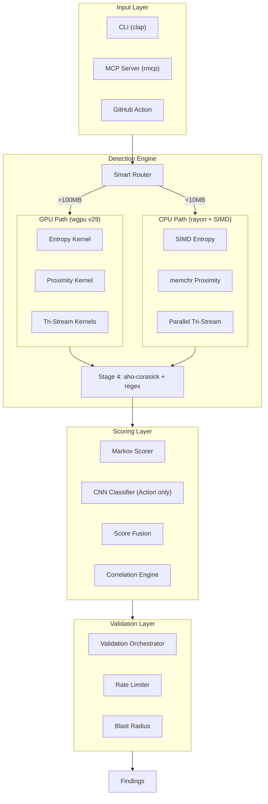

# Secret Squirrel — Technical Design Document (TDD)

**Version:** 1.0  
**Date:** May 26, 2026  
**Status:** Draft — Pending Review

---

## 1. System Architecture Overview



### Design Principles

1. **Zero-copy where possible** — mmap files, pass references not buffers
2. **Fail open, never crash** — malformed input → skip and log, not panic
3. **GPU/CPU parity** — identical findings regardless of execution path
4. **Profile-driven optimization** — lean CLI vs rich Action via compile-time features
5. **Streaming architecture** — process data as it arrives, don't buffer entire sources

---

## 2. Build Profiles & Feature Flags

```toml
# Cargo.toml feature flags
[features]
default = ["cli", "gpu", "cpu-simd"]

# Core features
cli = ["clap", "tabled"]
gpu = ["wgpu", "bytemuck", "encase"]
cpu-simd = []  # Uses std::arch intrinsics (stable Rust, AVX2/NEON)

# Deployment profiles
mcp-server = ["rmcp", "tokio"]
github-action = ["ort", "mcp-server"]  # Adds ONNX Runtime for CNN

# Optional features
semantic = ["tree-sitter"]
validate = ["reqwest", "tokio"]

# Source features (compile-time source selection)
source-git = ["git2"]
source-github = ["octocrab"]
source-gitlab = ["reqwest"]
source-s3 = ["aws-sdk-s3"]
source-docker = ["bollard"]
source-k8s = ["kube"]
source-slack = ["reqwest"]
source-all = [
    "source-git", "source-github", "source-gitlab",
    "source-s3", "source-docker", "source-k8s", "source-slack"
]
```

### Build Targets

| Target | Command | Features | Binary Size |
|---|---|---|---|
| CLI (lean) | `cargo build --release` | default | ~8-12 MB |
| CLI (all sources) | `cargo build --release -F source-all,validate` | default + sources + validation | ~12-15 MB |
| GitHub Action | `cargo build --release -F github-action,source-all,validate,semantic` | Everything | ~30-40 MB (Docker) |
| MCP Server | `cargo build --release -F mcp-server` | default + MCP | ~10-14 MB |

---

## 3. Component Design

### 3.1 Engine Layer (`src/engine/`)

#### `router.rs` — Smart GPU/CPU Routing

```rust
pub enum ExecutionPath {
    Gpu(GpuEngine),
    Cpu(CpuEngine),
}

pub struct Router {
    gpu: Option<GpuEngine>,
    cpu: CpuEngine,
    threshold_bytes: usize,  // Default: 100MB
}

impl Router {
    /// Decides execution path based on input size and GPU availability
    pub fn route(&self, input_size: usize) -> &dyn PipelineExecutor {
        match (&self.gpu, input_size) {
            (Some(gpu), size) if size > self.threshold_bytes => gpu,
            _ => &self.cpu,
        }
    }
}
```

#### `gpu.rs` — wgpu v29 Engine

```rust
pub struct GpuEngine {
    device: wgpu::Device,
    queue: wgpu::Queue,
    entropy_pipeline: wgpu::ComputePipeline,
    proximity_pipeline: wgpu::ComputePipeline,
    tristream_pipelines: [wgpu::ComputePipeline; 3],
    buffer_pool: TripleBufferPool,
}
```

**Triple-buffered memory pool:**
- Buffer A: Currently being filled by CPU (host → device transfer)
- Buffer B: Currently being processed by GPU compute
- Buffer C: Currently being read back by CPU (device → host transfer)
- Rotation on each dispatch cycle hides all transfer latency

#### `cpu.rs` — SIMD-Optimized CPU Engine

```rust
pub struct CpuEngine {
    thread_pool: rayon::ThreadPool,
    ac_automaton: aho_corasick::AhoCorasick,
}
```

Key CPU optimizations:
- `std::arch` intrinsics for AVX2/NEON vectorized byte histograms (stable Rust, 8 bytes per cycle)
- Per-platform implementations: `#[cfg(target_arch = "x86_64")]` → `_mm256_*`, `#[cfg(target_arch = "aarch64")]` → NEON
- `memchr` crate for SIMD-accelerated delimiter scanning
- `rayon::par_iter` for work-stealing parallelism across file chunks
- Memory-mapped I/O via `memmap2` for zero-copy file access

### 3.2 Stages Layer (`src/stages/`)

#### Stage 1: `entropy.rs`

```rust
pub struct EntropyGate {
    threshold: f32,            // Default: 3.5 (tunable per-rule)
    chunk_size: usize,         // Default: 64 bytes
    min_length: usize,         // Minimum string length to consider: 8
}

impl EntropyGate {
    /// Returns chunks with entropy above threshold
    /// GPU: dispatches entropy.wgsl compute shader
    /// CPU: uses SIMD histogram + scalar entropy calculation
    pub fn filter(&self, input: &[u8], engine: &dyn PipelineExecutor) -> Vec<EntropyCandidate>;
}

pub struct EntropyCandidate {
    pub offset: usize,
    pub length: usize,
    pub entropy: f32,
    pub raw: Bytes,            // Zero-copy reference to input
}
```

**WGSL Shader Design (`shaders/entropy.wgsl`):**
```
Workgroup size: 256 threads
Each thread: processes 64 bytes (16KB per workgroup)
Shared memory: local_histogram[256] (atomic u32)
Algorithm:
  1. Zero local histogram
  2. Each thread reads 64 bytes, atomicAdd to local histogram
  3. workgroupBarrier()
  4. Merge local → global histogram
  5. Fused entropy calculation: H = -Σ p(i) × log₂(p(i))
  6. Write per-chunk entropy to output buffer
  7. Binary flag: 1 if entropy > threshold, 0 otherwise
```

#### Stage 2: `proximity.rs`

```rust
pub struct ProximityAnalyzer {
    patterns: Vec<ProximityPattern>,  // Assignment shapes
}

pub enum ProximityPattern {
    Assignment,        // VAR = "..."
    Export,            // export KEY=
    JsonKey,           // "apiKey": "..."
    YamlKey,           // api_key:
    EnvVar,            // ENV['KEY'] or os.getenv("KEY")
    FunctionArg,       // connect(password="...")
    HeaderValue,       // Authorization: Bearer ...
}
```

#### Stage 3: `tristream.rs`

Three parallel streams analyzing different aspects of each candidate:
- **Stream A (`stream_id.rs`)**: Extracts variable/key names, scores against secret-keyword dictionary
- **Stream B (`stream_lit.rs`)**: Analyzes the literal value — Markov score, character class distribution, length
- **Stream C (`stream_ctx.rs`)**: Structural context — delimiters, quoting style, surrounding syntax

Output: `TriStreamScore { identifier: f32, literal: f32, structure: f32 }`

#### Stage 4: `pattern.rs`

```rust
pub struct PatternVerifier {
    ac: aho_corasick::AhoCorasick,     // Keyword pre-filter
    rules: Vec<CompiledRule>,          // Regex patterns
}

impl PatternVerifier {
    /// Only called on ~1% of input that survived stages 1-3
    pub fn verify(&self, candidates: &[Candidate]) -> Vec<RawFinding>;
}
```

### 3.3 Scoring Layer (`src/scoring/`)

#### `markov.rs` — Trigram Markov Scorer

```rust
pub struct MarkovScorer {
    trigram_table: [f32; 64 * 64 * 64],  // 262,144 entries, ~1MB
    // 64-char alphabet: a-z, A-Z, 0-9, '_', '-'
}

impl MarkovScorer {
    /// Returns probability that string is random (high = likely secret)
    /// Score range: 0.0 (natural language) to 1.0 (random bytes)
    pub fn score(&self, input: &str) -> f32;
}
```

#### `fusion.rs` — Score Fusion

```rust
pub struct FusedScore {
    pub confidence: f32,          // 0.0 - 1.0 composite
    pub entropy_score: f32,
    pub proximity_score: f32,
    pub tristream_score: TriStreamScore,
    pub markov_score: f32,
    pub pattern_strength: f32,
    pub cnn_score: Option<f32>,   // Only in GitHub Action profile
    pub ast_adjustment: Option<f32>,  // Only with --semantic
}
```

Fusion formula: weighted sum with configurable weights per rule category.

#### `correlation.rs` — Cross-File Correlation

```rust
pub struct CorrelationEngine {
    by_value: HashMap<SecretHash, Vec<FindingRef>>,
    by_variable: HashMap<String, Vec<FindingRef>>,
}

impl CorrelationEngine {
    pub fn ingest(&mut self, finding: &Finding);
    pub fn resolve_chains(&self) -> Vec<CredentialChain>;
}

pub struct CredentialChain {
    pub variable_name: String,
    pub origin: FindingRef,           // Where the secret is defined
    pub propagation: Vec<FindingRef>, // Where it's referenced
    pub usage: Vec<FindingRef>,       // Where it's consumed at runtime
    pub chain_confidence: f32,
}
```

### 3.4 CNN Classifier (`src/scoring/cnn.rs`, GitHub Action only)

```rust
#[cfg(feature = "github-action")]
pub struct CnnClassifier {
    session: ort::Session,  // ONNX Runtime session
    tier: ModelTier,
}

#[derive(Clone, Copy)]
pub enum ModelTier {
    Tiny,      // 500K params, ~2MB FP32 — GitHub Actions default
    Large,     // 1M params, ~4MB FP32 — Self-hosted CPU default
    Enhanced,  // TinyBERT, 14.5M params, ~55MB — GPU tier
    Maximum,   // DistilBERT, 66M params, ~260MB — GPU tier
}

#[cfg(feature = "github-action")]
impl CnnClassifier {
    /// Load FP32 ONNX model for the selected tier
    /// Models are downloaded on demand via `squirrel model pull <tier>`
    pub fn load(tier: ModelTier) -> Result<Self>;
    
    /// Classify candidate string as secret (>0.5) or not (<0.5)
    /// Large model returns multi-class: password/token/key/etc.
    pub fn classify(&self, input: &str) -> f32;
}
```

**Model architecture (Tiny — GitHub Action default):**
- Input: character-level encoding (ASCII, max 256 chars, padded)
- Char Embedding: 100-char alphabet → 64-dim
- Conv1D(128, kernel=3) → ReLU → GlobalMaxPool1D
- Conv1D(128, kernel=4) → ReLU → GlobalMaxPool1D
- Conv1D(128, kernel=5) → ReLU → GlobalMaxPool1D
- Concatenate (384-dim)
- FC: Dropout(0.3) → 384 → 128 → ReLU → Dropout(0.3) → 1 (sigmoid)
- Total parameters: **500K**
- FP32 model size: **~2MB**
- CPU inference: ~300-500μs
- Accuracy (distilled from CodeBERT): 96-97%

**Model architecture (Large — Self-hosted CPU default):**
- Input: character-level encoding (ASCII, max 512 chars, padded)
- Char Embedding: 100-char alphabet → 128-dim
- Conv1D(256, kernel=3,4,5,7,9) blocks with BatchNorm + ReLU
- GlobalMaxPool1D each → Concatenate (896-dim)
- FC: 512 → ReLU → Dropout(0.4) → 256 → ReLU → Dropout(0.3) → num_classes (Softmax)
- Multi-class output: password/token/key/etc.
- Total parameters: **1M**
- FP32 model size: **~4MB**
- CPU inference: ~500μs-1ms, GPU: ~100-200μs
- Accuracy (distilled from CodeBERT): 98-99%

**GPU tiers (self-hosted, user-selectable via `--model-tier`):**

| Tier | Model | Params | Size | GPU Inference | Accuracy |
|---|---|---|---|---|---|
| `default` | Large Char-CNN (FP32) | 1M | ~4 MB | 100-200μs | 98-99% |
| `enhanced` | TinyBERT (2-pass) | 14.5M | ~55 MB | <1ms | ~99% |
| `maximum` | DistilBERT (2-pass) | 66M | ~260 MB | 1-2ms | ~99.5% |

> Models downloaded on demand: `squirrel model pull <tier>`. Configurable via `--model-tier default|enhanced|maximum`.

### 3.5 Rule Engine (`src/rules/`)

#### TOML Compatibility Layer

```rust
pub struct Rule {
    // Betterleaks/Gitleaks-compatible fields
    pub id: String,
    pub description: String,
    pub regex: Regex,
    pub keywords: Vec<String>,
    pub entropy: Option<f32>,        // Legacy entropy threshold
    pub allowlist: Option<Allowlist>, // Legacy allowlists (translated to filter)
    pub filter: Option<String>,      // CEL-compatible filter expression
    
    // Secret Squirrel extensions (in [rules.squirrel] section)
    pub squirrel: Option<SquirrelExtension>,
}

pub struct SquirrelExtension {
    pub entropy_threshold: Option<f32>,
    pub proximity_patterns: Vec<String>,
    pub confidence_weight: f32,
    pub category: String,              // Hierarchical: "cloud.aws.iam"
    pub validation: Option<String>,    // Validation expression
}
```

**Parsing precedence:** `.squirrel.toml` > `.betterleaks.toml` > `.gitleaks.toml` > built-in defaults

### 3.6 Source Adapter Interface (`src/sources/`)

```rust
/// Async source trait — for network/API sources (GitHub, S3, Slack, etc.)
#[async_trait]
pub trait Source: Send + Sync {
    /// Human-readable name (e.g., "GitHub", "S3")
    fn name(&self) -> &str;
    
    /// Streaming iterator of scannable fragments
    fn fragments(&self) -> Pin<Box<dyn Stream<Item = Result<Fragment>> + Send>>;
}

/// Sync source trait — for local filesystem sources (Dir, Git, Stdin, etc.)
/// Avoids async overhead for the 80% local-scanning case.
pub trait SyncSource: Send + Sync {
    fn name(&self) -> &str;
    
    /// Returns an iterator of fragments (no async runtime needed)
    fn fragments(&self) -> Box<dyn Iterator<Item = Result<Fragment>> + Send + '_>;
}

/// Dispatch enum — unifies async and sync sources for the pipeline
pub enum SourceStream {
    Async(Pin<Box<dyn Stream<Item = Result<Fragment>> + Send>>),
    Sync(Box<dyn Iterator<Item = Result<Fragment>> + Send>),
}

impl SourceStream {
    pub fn from_source(source: &dyn Source) -> Self {
        Self::Async(source.fragments())
    }
    pub fn from_sync(source: &dyn SyncSource) -> Self {
        Self::Sync(source.fragments())
    }
}
```

```rust
pub struct Fragment {
    pub content: Bytes,            // Raw content (zero-copy where possible)
    pub metadata: FragmentMetadata,
}

pub struct FragmentMetadata {
    pub path: String,              // File path or resource identifier
    pub source_type: SourceType,   // Git, GitHub, S3, etc.
    pub attributes: HashMap<String, String>,  // Source-specific metadata
    pub size: usize,
}
```

Local sources (Dir, Git, Stdin, Archives, .env, Terraform) implement `SyncSource`. Network sources (GitHub, GitLab, S3, Docker, Slack, Jira, K8s) implement `Source`. The engine processes `SourceStream` identically regardless of dispatch path.

### 3.7 Validation Engine (`src/validate/`)

```rust
pub struct ValidationEngine {
    providers: HashMap<String, Box<dyn Validator>>,
    rate_limiters: HashMap<String, TokenBucket>,
    client: reqwest::Client,  // Built with redirect::Policy::none()
}

impl ValidationEngine {
    pub fn new() -> Result<Self> {
        let client = reqwest::Client::builder()
            .redirect(reqwest::redirect::Policy::none())  // No redirect following
            .build()?;
        // ...
    }
}

#[async_trait]
pub trait Validator: Send + Sync {
    fn provider_name(&self) -> &str;
    fn can_validate(&self, rule_id: &str) -> bool;
    async fn validate(&self, finding: &Finding) -> ValidationResult;
    async fn enumerate_permissions(&self, finding: &Finding) -> Option<BlastRadius>;
}

pub struct ValidationResult {
    pub status: ValidationStatus,  // Active, Inactive, Revoked, NeedsValidation, Error, Unknown
    pub reason: Option<String>,
    pub blast_radius: Option<BlastRadius>,
    pub validated_at: DateTime<Utc>,
}

pub struct BlastRadius {
    pub provider: String,
    pub permissions: Vec<String>,     // e.g., ["s3:*", "iam:GetUser"]
    pub resources: Vec<String>,       // e.g., ["arn:aws:s3:::prod-*"]
    pub risk_level: RiskLevel,        // Critical, High, Medium, Low
}
```

---

## 4. Data Flow

```
Input Source
    ↓
Fragment Stream (async, zero-copy)
    ↓
┌─────────────────────────────────────────┐
│ Smart Router (input size → GPU or CPU)  │
└────────────┬────────────────────────────┘
             ↓
┌─────────────────────────────────────────┐
│ Stage 1: Shannon Entropy Gate           │
│   H(x) = -Σ p(i) × log₂(p(i))         │
│   Threshold: 3.5 default               │
│   Output: ~5% of input survives        │
└────────────┬────────────────────────────┘
             ↓
┌─────────────────────────────────────────┐
│ Stage 2: Semantic Proximity             │
│   Shape detection: VAR="...", export,   │
│   JSON keys, YAML keys, function args   │
│   Output: ~3% of input survives        │
└────────────┬────────────────────────────┘
             ↓
┌─────────────────────────────────────────┐
│ Stage 3: Tri-Stream Decomposition       │
│   A: Identifier extraction + scoring    │
│   B: Literal value analysis + Markov    │
│   C: Structural context analysis        │
│   Output: per-candidate TriStreamScore  │
└────────────┬────────────────────────────┘
             ↓
┌─────────────────────────────────────────┐
│ Stage 4: Pattern Verification           │
│   Aho-Corasick keyword match            │
│   Regex validation on keyword hits      │
│   Output: ~1% → raw findings            │
└────────────┬────────────────────────────┘
             ↓
┌─────────────────────────────────────────┐
│ Score Fusion                            │
│   Markov score + pipeline scores        │
│   + CNN score (Action profile only)     │
│   + AST adjustment (--semantic only)    │
│   Output: findings with confidence      │
└────────────┬────────────────────────────┘
             ↓
┌─────────────────────────────────────────┐
│ Cross-File Correlation (--correlate)    │
│   Link findings across files by value   │
│   and variable name                     │
│   Output: credential chains             │
└────────────┬────────────────────────────┘
             ↓
┌─────────────────────────────────────────┐
│ Validation (--validate, opt-in)         │
│   Provider API checks                   │
│   Permissions enumeration               │
│   Rate-limited, async                   │
│   Output: validated findings + blast    │
└────────────┬────────────────────────────┘
             ↓
         Findings
    (JSON / SARIF / Table / CSV)  ← see src/report/csv.rs
```

---

## 5. CLI Interface

```
squirrel [COMMAND] [OPTIONS]

COMMANDS:
    detect          Scan for secrets (default)
    validate        Validate specific findings
    mcp-server      Start MCP tool server
    rules           List/search available rules
    model           Manage ML models
    version         Print version info

DETECT OPTIONS:
    -s, --source <PATH>         Source to scan (directory, repo, URL)
    -c, --config <PATH>         Config file (.squirrel.toml, .betterleaks.toml, .gitleaks.toml)
    -r, --report-format <FMT>   Output format: json, sarif, table, csv (default: json)
    -o, --report-path <PATH>    Write report to file (default: stdout)
    --exit-code <CODE>          Exit code when findings detected (default: 1)
    --validate                  Enable live credential validation
    --correlate                 Enable cross-file credential chain detection
    --semantic                  Enable tree-sitter AST analysis
    --baseline <PATH>           Compare against previous scan results
    --confidence <THRESHOLD>    Minimum confidence score (0.0-1.0, default: 0.5)
    --model-tier <TIER>         CNN model tier: default|enhanced|maximum (default: per-profile)
    --gpu                       Force GPU execution
    --no-gpu                    Force CPU-only execution
    --workers <N>               Number of parallel workers (default: auto)
    --max-file-size <BYTES>     Skip files larger than this (default: 10MB)
    --include-rule <ID>         Only run specific rules
    --exclude-rule <ID>         Skip specific rules
    --show-secrets              Show unredacted secrets (requires SQUIRREL_ALLOW_SHOW_SECRETS=1)
    --verbose                   Verbose output
    -q, --quiet                 Suppress non-finding output

MODEL COMMANDS:
    squirrel model pull <tier>  Download a model tier (default|enhanced|maximum)
    squirrel model list         List available and downloaded models

SOURCE-SPECIFIC:
    squirrel detect git <PATH>
    squirrel detect github <URL> [--include <resources>] [--exclude <resources>]
    squirrel detect gitlab <URL>
    squirrel detect s3 <URL> [--anonymous] [--workers N]
    squirrel detect docker <IMAGE>
    squirrel detect slack <WORKSPACE> --token <TOKEN>
    squirrel detect jira <URL> --token <TOKEN>
    squirrel detect k8s [--namespace <NS>] [--context <CTX>]
    squirrel detect terraform <PATH>
    squirrel detect stdin < input.txt
```

---

## 6. GitHub Action Interface

```yaml
# .github/workflows/secret-scan.yml
name: Secret Squirrel Scan
on: [push, pull_request]

permissions:
  security-events: write   # SARIF upload
  pull-requests: write      # PR comments
  contents: read            # Repo access

jobs:
  scan:
    runs-on: ubuntu-latest
    steps:
      - uses: actions/checkout@v4
        with:
          fetch-depth: 0    # Full history for git scanning

      - uses: secret-squirrel/action@v1
        with:
          scan-mode: 'diff'              # 'full' | 'diff' | 'staged'
          config-path: '.squirrel.toml'  # Optional
          severity-threshold: 'medium'   # 'low' | 'medium' | 'high' | 'critical'
          validate: false                # Live validation (default: false)
          sarif-upload: true             # Upload to Security tab
          pr-comments: true              # Inline PR annotations
          fail-on-findings: true         # Fail check if secrets found
          cnn-enabled: true              # ML classification (default: true in Action)
          correlate: true                # Cross-file correlation
          extra-sources: ''              # Additional sources to scan
```

---

### MCP Server Tools

The MCP server (`squirrel mcp-server`) exposes the following tools to AI agents:

| Tool | Description | Input | Output |
|---|---|---|---|
| `scan` | Scan a source for secrets | `{ source: string, config?: string, confidence?: f32 }` | `Finding[]` |
| `scan_diff` | Scan only changed lines in a diff | `{ diff: string, config?: string }` | `Finding[]` |
| `validate_finding` | Validate a specific finding by ID | `{ finding_id: string }` — **Finding IDs only, never raw secret strings** | `ValidationResult` |
| `get_rules` | List available detection rules | `{ category?: string, search?: string }` | `Rule[]` |
| `get_findings` | Retrieve findings from current/previous scan | `{ scan_id?: string, min_confidence?: f32 }` | `Finding[]` |

**Security constraints:**
- **Path sandboxing:** All file paths are sandboxed to the workspace root. Absolute paths and symlinks outside the workspace are rejected.
- **No credential oracle:** `validate_finding` accepts Finding IDs only — never raw secret strings — to prevent MCP clients from using the tool as a credential validation oracle.

**Transport:**
- **stdio** (default): For local IDE integrations
- **HTTP+SSE**: For remote/networked MCP clients
  - Bind address: `127.0.0.1` only (no external network exposure)
  - Authentication: Bearer token required (configured via `--mcp-token` or `SQUIRREL_MCP_TOKEN` env var)
  - Transport: Server-Sent Events for streaming responses

---

## 7. Dependency Inventory

### Core Dependencies

| Crate | Version | Purpose | Size Impact |
|---|---|---|---|
| `clap` | 4.x | CLI argument parsing | ~300KB |
| `serde` + `toml` | 1.x / 0.8 | Rule file parsing | ~200KB |
| `aho-corasick` | 1.x | Multi-pattern string matching | ~100KB |
| `regex` | 1.x | Pattern verification | ~500KB |
| `fancy-regex` | 0.13+ | Backreference fallback for Betterleaks rule compat | ~200KB |
| `rayon` | 1.x | Parallel iteration | ~100KB |
| `memmap2` | 0.9 | Memory-mapped file I/O | ~10KB |
| `memchr` | 2.x | SIMD byte searching | ~50KB |
| `bytes` | 1.x | Zero-copy buffers for Fragment/mmap pipeline | ~50KB |
| `bytemuck` | 1.x | Zero-cost byte casting | ~10KB |
| `ignore` | 0.4 | .gitignore-aware file walking | ~100KB |
| `git2` | 0.19+ | Git repository access (libgit2 bindings) | ~500KB |
| `tokio` | 1.x | Async runtime (validation, MCP, sources) | ~500KB |
| `reqwest` | 0.12 | HTTP client (validation, API sources) — `redirect::Policy::none()` | ~800KB |
| `crossbeam-channel` | 0.5 | Bounded channels for pipeline stage backpressure | ~50KB |
| `tracing` | 0.1 | Structured logging (spans + events) | ~100KB |
| `tracing-subscriber` | 0.3 | Log output (JSON formatter) | ~200KB |
| `thiserror` | 2.x | Derive-based error types | ~10KB |
| `secrecy` | 0.10+ | Secret memory handling (wraps RedactedString) | ~20KB |
| `zeroize` | 1.x | Memory zeroing on Drop | ~10KB |

### GPU Dependencies (feature-gated)

| Crate | Version | Purpose | Size Impact |
|---|---|---|---|
| `wgpu` | 29.x | Cross-platform GPU compute | ~3MB |
| `encase` | 0.9 | WGSL buffer layout derives | ~50KB |

### GitHub Action Dependencies (feature-gated)

| Crate | Version | Purpose | Size Impact |
|---|---|---|---|
| `ort` | 2.x | ONNX Runtime (CNN inference) — use static-linking feature or vendor `libonnxruntime.so` | ~15-20MB |

### MCP Dependencies (feature-gated)

| Crate | Version | Purpose | Size Impact |
|---|---|---|---|
| `rmcp` | 0.1+ | MCP server SDK | ~200KB |

---

## 8. Security Model

### Threat Model

| Threat | Mitigation |
|---|---|
| Scanner leaks found secrets | Findings redact secret values by default; full value only with `--show-secrets` (requires `SQUIRREL_ALLOW_SHOW_SECRETS=1` env var) |
| MCP tool injection | Input sanitization; no shell execution; structured JSON schema validation; path sandboxing to workspace root |
| MCP credential oracle | `validate_finding` accepts Finding IDs only (never raw secret strings) |
| MCP path traversal | Sandbox all paths to workspace root; reject absolute paths; no symlink following |
| Validation exposes secrets to network | HTTPS-only for all validation calls; opt-in only; `redirect::Policy::none()` on reqwest client |
| Rate limiting abuse | Per-provider token bucket with configurable ceilings |
| Malformed input causes crashes | Fuzz testing with `cargo-fuzz`; all panics caught at boundary |
| GitHub Action token theft | Minimal permissions; GITHUB_TOKEN scoped per-job |
| Rule injection via hot-reload URL | HTTPS-only; rule signatures required (cosign/minisign) |
| ReDoS via crafted rule regex | Regex complexity limits, timeouts |
| Zip bomb / decompression bomb | 100:1 decompression ratio limit |
| Core dump secret exposure | `zeroize` on Drop, `mlock()` for secret pages, disable core dumps |
| SARIF unredacted context | Scan context lines for secrets before including in output |
| GPU side-channel | Clear GPU buffers after use |

### Secret Handling in Output

```rust
pub struct Finding {
    pub rule_id: String,
    pub description: String,
    pub secret: RedactedString,      // Always redacted in output by default
    pub secret_hash: String,         // SHA-256 for correlation without exposing value
    pub match_text: String,          // Full line with secret redacted
    pub location: Location,
    pub confidence: f32,
    pub chain: Option<CredentialChain>,
    pub validation: Option<ValidationResult>,
}

pub struct RedactedString {
    inner: secrecy::Secret<String>,  // Zeroized on Drop, never serialized raw
}

impl Serialize for RedactedString {
    fn serialize<S>(&self, s: S) -> Result<S::Ok, S::Error> {
        use secrecy::ExposeSecret;
        let value = self.inner.expose_secret();
        let char_count = value.chars().count();
        
        // Tiered char-based redaction — never expose >40% of the secret
        let redacted = match char_count {
            // ≤8 chars: first 2 + "****"
            0..=8 => {
                let prefix: String = value.chars().take(2).collect();
                format!("{}****", prefix)
            }
            // 9-16 chars: first 4 + "****" + last 2
            9..=16 => {
                let prefix: String = value.chars().take(4).collect();
                let suffix: String = value.chars().rev().take(2).collect::<Vec<_>>()
                    .into_iter().rev().collect();
                format!("{}****{}", prefix, suffix)
            }
            // 17-32 chars: first 4 + "****" + last 4
            17..=32 => {
                let prefix: String = value.chars().take(4).collect();
                let suffix: String = value.chars().rev().take(4).collect::<Vec<_>>()
                    .into_iter().rev().collect();
                format!("{}****{}", prefix, suffix)
            }
            // 32+ chars: first 4 + "****" + last 4
            _ => {
                let prefix: String = value.chars().take(4).collect();
                let suffix: String = value.chars().rev().take(4).collect::<Vec<_>>()
                    .into_iter().rev().collect();
                format!("{}****{}", prefix, suffix)
            }
        };
        s.serialize_str(&redacted)
    }
}

impl Drop for RedactedString {
    fn drop(&mut self) {
        // secrecy::Secret<String> handles zeroization automatically
    }
}
```

> **`--show-secrets` gate:** The `--show-secrets` flag is additionally gated behind the `SQUIRREL_ALLOW_SHOW_SECRETS=1` environment variable. Both the flag AND the env var must be present to expose unredacted secret values.

---

## 9. Testing Strategy

### Unit Tests
- Entropy calculation: verify H(x) for known inputs
- Markov scorer: verify scores for known secrets vs English text
- Rule parser: compatibility with all Betterleaks/Gitleaks TOML variants
- Each source adapter: mock API responses
- Correlation engine: known multi-file credential chain scenarios
- CNN classifier: verify predictions match known inputs (Action profile only)

### Integration Tests
- Full pipeline: scan synthetic repos with planted secrets, verify all found
- GPU/CPU parity: run same input through both paths, assert identical findings
- Betterleaks compatibility: run Betterleaks test suite, verify matching results
- MCP server: automated tool invocations via MCP protocol
- GitHub Action: act runner simulation

### Benchmark Suite
- CredData recall/precision: automated scoring against labeled dataset
- SecretBench: precision measurement on real-world repos
- Throughput: MB/s on standardized corpus (1GB synthetic repo)
- Latency: p50/p95/p99 per-file latency distribution
- Memory: peak RSS tracking across scan sizes

### Fuzz Testing
- `cargo-fuzz` on all input parsers (TOML, git, HTTP responses)
- Structured fuzzing of rule regex patterns
- MCP message fuzzing

---

## 10. Deployment Architecture

### CLI Release Pipeline

```
GitHub Actions → cargo build (matrix: linux-x86_64, linux-aarch64, macos-x86_64, macos-aarch64, windows-x86_64)
    → strip + compress
    → GitHub Releases (binary assets)
    → Homebrew formula update
    → crates.io publish
    → Docker Hub push (ghcr.io/secret-squirrel/squirrel:latest)
```

### GitHub Action Release Pipeline

```
GitHub Actions → Docker build (multi-stage)
    Stage 1: cargo build --release -F github-action,source-all,validate,semantic
    Stage 2: Copy binary + ONNX model into slim runtime image
    → ghcr.io/secret-squirrel/action:v1
    → GitHub Marketplace publish
```

**Dockerfile (GitHub Action):**
```dockerfile
FROM rust:1.82-slim AS builder
# Build with all features including ONNX (static linking preferred)
RUN cargo build --release -F github-action,source-all,validate,semantic
# Copy ONNX model
COPY models/secret_classifier.onnx /models/

FROM debian:bookworm-slim
COPY --from=builder /target/release/squirrel /usr/local/bin/
COPY --from=builder /models/secret_classifier.onnx /usr/local/share/squirrel/
# ONNX Runtime: use ort's static-linking feature, or explicitly vendor the shared lib:
# COPY --from=builder /usr/local/lib/libonnxruntime.so /usr/local/lib/
# RUN ldconfig
COPY entrypoint.sh /
# Health check — verify binary runs and ONNX loads
RUN squirrel --version
ENTRYPOINT ["/entrypoint.sh"]
```
